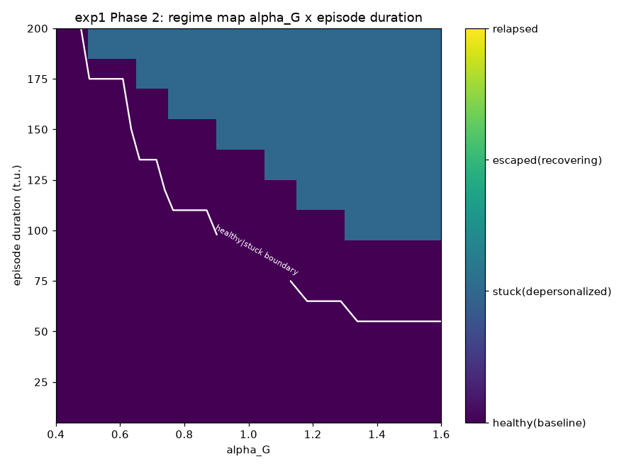
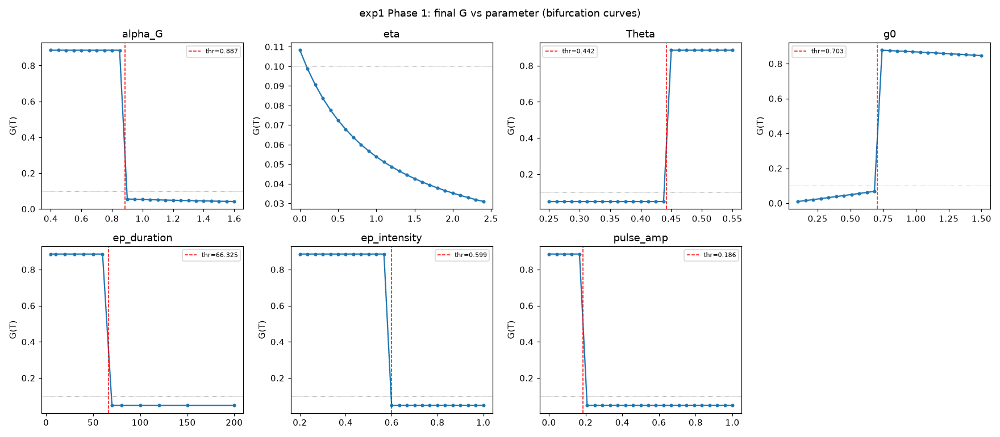
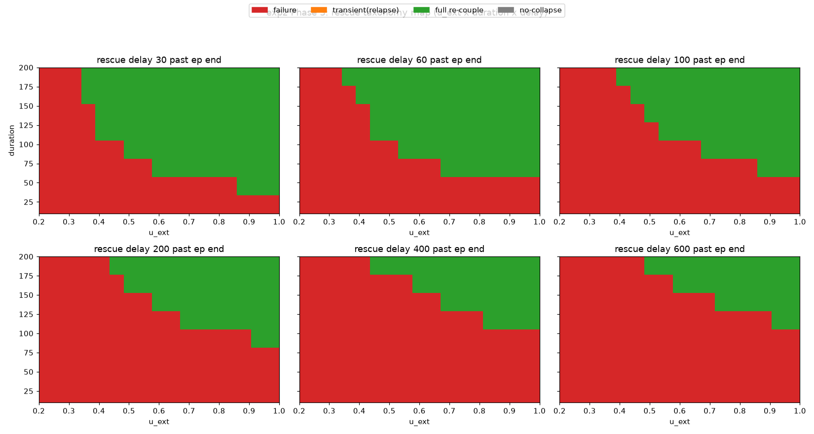
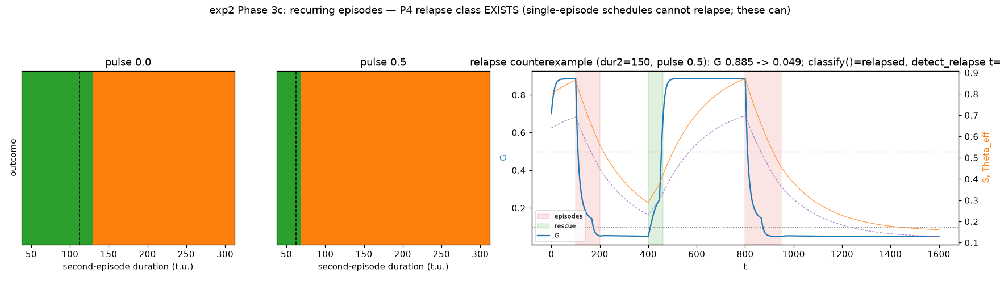
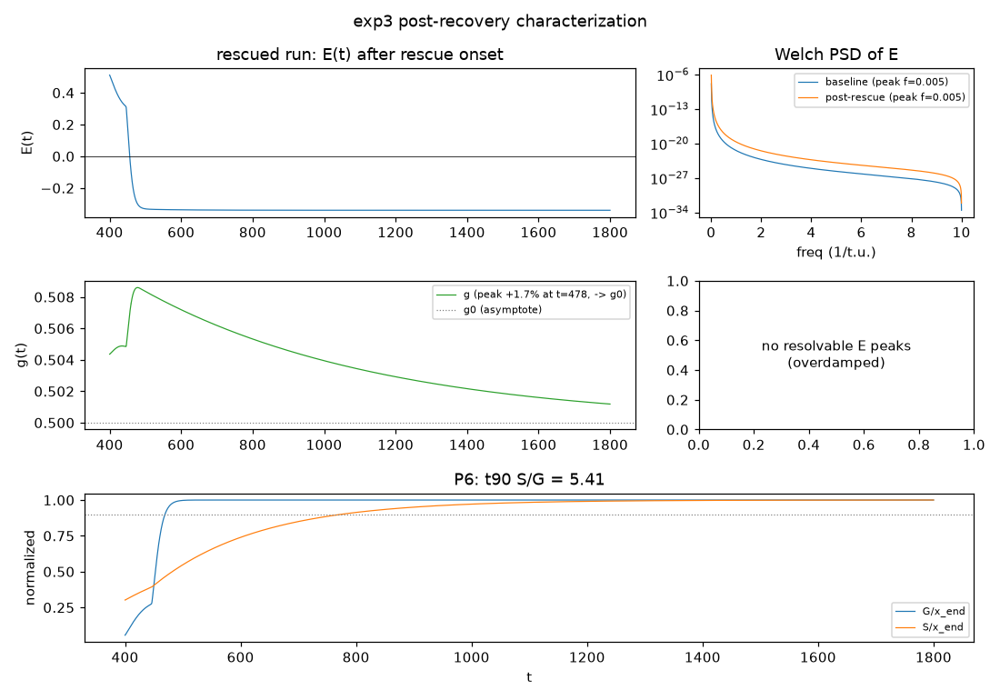
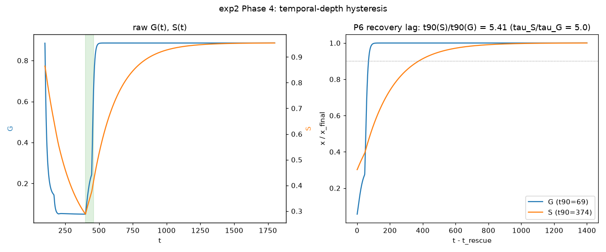
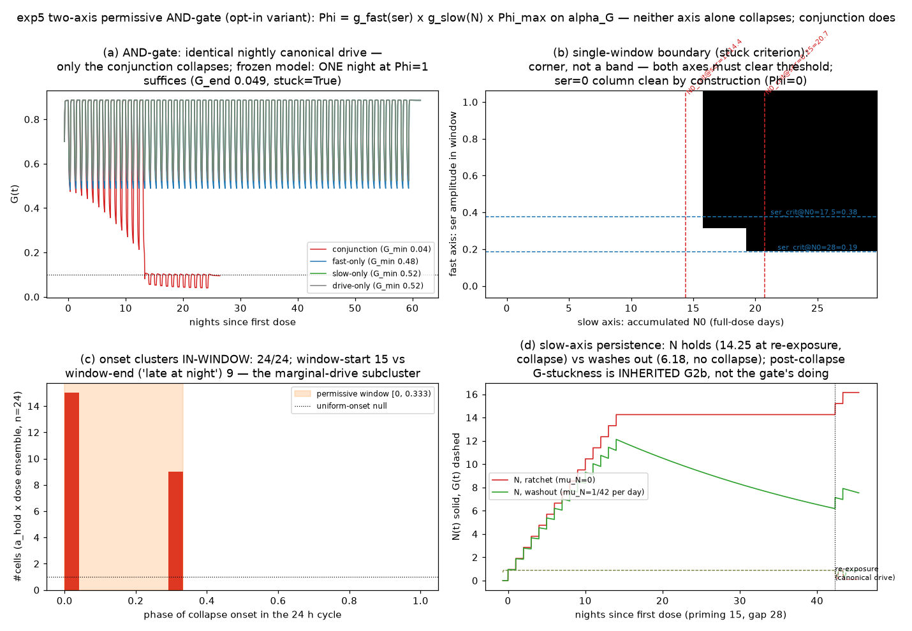
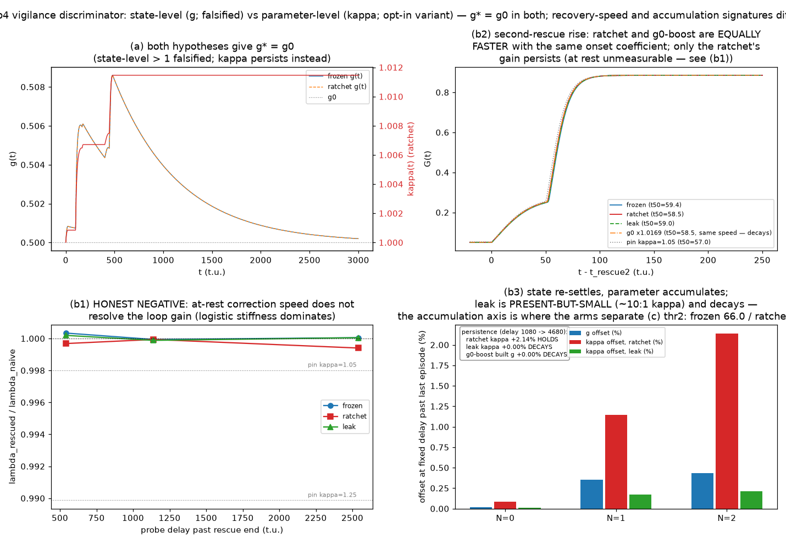

# Self-Application as the Common Source of Benefit and Failure: A Control-Theoretic Model of Self-Regulation, Its Escapes, and a Standing-Cost Budget

Jaye Timothy Marshall — ORCID 0009-0002-5209-8161

**Status.** Preprint. All quantitative claims are traceable to project artifacts: the versioned documents `dpdr/predictions.md`, `dpdr/README.md`, `dpdr/external-validation.md`; the code (`dpdr/dpdr/*.py`, cited as file:line); the figures (now embedded as Figures 1–14 from `figures/`); the cached numerical results (`dpdr/cache/*.npz`, with their committed drivers and pre-registrations under `dpdr/experiments/`); the CSD/border-collision audit (`csd/RESULT.md` and its scripts, cited as [TR-29]); and the project's internal experiment-record index ([TR], Appendix A), whose entries point to these shipped artifacts. Claims that are synthesis rather than measurement are marked as such; conjectures are marked as conjectures. In addition, every substantive claim in this paper belongs to one of two registers, and we keep them separate: **(A) dynamical facts** are computed results of the specified system — reproducible from the code and caches — and **(B) agent interpretations** are readings of those facts in the vocabulary of agents (values, beliefs, care, goals, decisions); where such a reading appears it is marked *interpretation*. The separation is load-bearing: the model is a control system with one setpoint and no value, preference, goal, or representational term anywhere in it (§2.1), so agent vocabulary can never be a measurement of it — at most a reading, and only ever of the agent yet to be built (§8 and the follow-up documents), not of the model itself. The claim-by-claim sorting is tabulated in the companion audit `claim-audit.md`. The literature engagement in §7 is based on the reading recorded in the project's literature-sweep notes; where a primary source has not been read in full, that is stated.

---

## Abstract

We study a deterministic five-state control model of a self-regulating system — a generator of self-content, a demand/reduction process, and an attentional control loop — whose failure mode is collapse of the generator into a self-maintaining state with no outward pull, a structure taken from the phenomenology of depersonalization-derealization (DPDR). The model is not offered as a novel account of self-reference: the duality we quantify is classical (Hofstadter's strange loops; the distinction between vicious and non-vicious circularity; termination in term rewriting), and the monitoring-cost tradeoff we measure is anticipated by dual control theory (Feldbaum, 1960–61; 1965), whose probing–performance tension our c_mon ceiling quantifies for a self-monitoring channel, and in architecture by metacognitive accounts of allostatic regulation (Stephan et al., 2016), which propose the influencing monitor without a cost model or ceiling. The contribution is threefold. First, quantification: in one concrete setting we locate the boundaries numerically — a floor critical for escape (0.4795, matching the collapsed state's own error level 0.4969), a monitoring-cost critical (0.511 gated, 0.112 ungated), a hyperbolic capability-recoverability boundary (r·φ ≈ 0.1122), and a collapse-termination gate expressible as an AND over the absence of external content and the absence of an early terminator; on the chronic-drive axis the collapse threshold is further resolved as a border-collision fold with shrinking-basin, not slowing, signatures; and the collapse mechanism itself is measured twice over — the threshold is the allostatic setpoint draining to meet a saturated deficit (the runaway/crush damage split regime-dependent), the corrective gain loop is inert by an amplitude ceiling rather than a timescale, and the collapsed terminal state is residence in the *relaxed* attentional position with the reduction switch armed, an effortful state appearing only as a transit. Second, substrate-independence: the same floor principle recurs in a hand-built SLD-resolution engine (a one-slot cycle cache resolves self-referential depth that otherwise never terminates) and in cut-elimination complexity (keeping lemmas — not eliminating them — is the cheap escape), and the reuse/expansion dichotomy recurs in Datalog provenance (the fully expanded formula growing as 2^(n−1) against a polynomial circuit), though all three are classical results whose value here is the mapping. Third, a structural obstacle identified, the realization that removes it built, and the measured negative reported: the introspection-threshold lower bound of Zhang, Yuan & Zhang (2026, arXiv 2607.04277) cannot be tested by the window assay — its benefit term is monotone in capacity by construction, so no lower threshold could have appeared there — and we built the generational realization that removes the obstruction (a persistent, compounding modification operator with certified and fallible adoption arms, run across the capacity grid); no lower threshold appears at any capacity tested, no degradation criterion fires, and the fallible arm never makes an uncertified adoption. That negative is evidence on the threshold-sharpness open problem the conjecture's v2 itself names — not a test of a theorem, and not a falsification. The assay is untestable by the window; the generational result is evidence, not falsification. One framing fact governs every claim: the model is a control system with a single setpoint and no value, goal, preference, or representational term, so every result below is a **dynamical fact** about that system; where we additionally read a fact in the vocabulary of agents (belief, care, deliberation, self-protection), that reading is marked as an *interpretation*. The unifying reading — self-application supplies both the benefit and the failure; viable escapes make it well-founded or route it outside; the operative constraint is a budget on standing self-application cost — is a dynamical pattern first and the paper's synthesis over its measurements second, offered as an interpretation in agent terms for an agent yet to be built (§8), not as a measured property of an agent. The three-channel agreement on 0.112 is reported for what it is: a consistency check that the designed self-simulation cost channel lands where it was aimed (by construction, not empirical convergence), plus the verified fact that the collapse bound is on the standing cost intensity — the cost-rate × horizon product normalized by the simulation time constant, c_cap·T/τ_sim with τ_sim = 200 — rather than on the horizon alone. We specify what would falsify each claim, and we enumerate the limitations honestly: the results are deterministic and in-model; the synthesis is largely internal consistency over one model derived from one first-person report; one of six pre-registered predictions fails outright and another is largely built-in; and only one of eight externally testable predictions has existing independent data.

**Keywords:** self-application; self-reference; self-regulation; control theory; dynamical systems; attractors; critical slowing down; border-collision bifurcation; hysteresis; depersonalization-derealization (DPDR); cut-elimination; Datalog

---

## 1. Introduction

A system that regulates itself must, in some part, apply its processing to itself. The applied part can be productive: a self-model lets the system anticipate its own errors and correct them. The same application can also be destructive: the applied processing consumes the capacity it monitors, and the monitoring itself is inward-directed load. This dual character of self-application is not a new observation. It is the substance of Hofstadter's strange loops [1]; it is the standing philosophical distinction between vicious and non-vicious (productive) circularity [2]; and in term-rewriting theory it is the difference between terminating and non-terminating reduction, with confluence undecidable in general [3]. In control engineering, the specific tension that self-monitoring both informs and perturbs control is the subject of dual control theory, pioneered by Feldbaum [4]. None of this paper's central mechanism should be read as a discovery of that duality.

What this paper offers is narrower and, we think, still useful: a quantification of the duality's boundaries in one concrete, frozen, fully specified dynamical system; a demonstration that the same structure appears in three non-dynamical formalisms (a resolution engine, cut-elimination, and Datalog provenance), which is evidence of substrate-independence rather than of novelty; and one external, published, informal conjecture carried into a concrete realization, where the window assay meets a structural obstacle we identify precisely — any realization whose benefit term is monotone in capacity cannot test this class of conjecture, by construction, independent of the system's physics — and where the generational realization built to remove that obstacle (compounding certified and fallible self-modification across generations) measures no lower threshold at any capacity tested: evidence on the threshold-sharpness open problem the conjecture's v2 names, not a test of a theorem.

The vehicle is a five-state ODE model built to reproduce the cascade of depersonalization-derealization as described in a first-person report (the project's source document; neither it nor the model brief is included in this artifact): sustained inward attention weakens a generator of self-content, error rises past a threshold, a reduction process consumes self-content, attention is captured further inward, and the system settles into a stable state with no outward pull. External demand — work, crisis, conversation — pulls attention outward and permits recovery. The model reproduces this cascade and its rescue with six pre-registered predictions tested, five passing under stated conditions and one failing (§4.1). DPDR is the modeling origin, but the paper's claims are control-theoretic, not clinical: the clinical literature is engaged in §7 as prior and adjacent work, and the model is not validated against independent clinical data (§6, items 8–9).

Three results organize the paper:

1. **The escape taxonomy and its terminator reading** (§4.2–4.3). Every intervention that rescues the collapsed system — an external content stream, a cheap fixed floor on the collapse switch, a cycle check — either terminates the self-application or redirects it outward (in the agent reading, a standing external demand is an outward "vocation" for the reducer; that gloss is an *interpretation*, not a mechanism). The one measured exception that proves the structure: continuously re-examining the floor while holding it (an always-on monitoring cost of ~0.2) defeats the floor, reproducing independently the "knowing floor" critical measured earlier [TR-4, TR-5].

2. **A budget on standing self-application cost** (§4.5). The cost of bounded self-simulation is a standing inward drive, and the collapse boundary it produces is a bound on the **product** of cost rate and horizon normalized by the simulation time constant (c_cap·T/τ_sim ≈ 0.112, with τ_sim = 200 t.u. imported from the slowest model time constant τ_g; verified identical across a 4× range of cost rates — the hyperbola is forced by construction, since the standing cost is the only horizon-dependence of the healthy asymptote). This value coincides with the two previously measured criticals (chronic-hold 0.11213, ungated monitoring 0.112); we report that agreement as what it is — a consistency check that the designed cost channel enters the equations where it was aimed. It is **not** an empirical unification: all three channels are the same kind of term in the same slot of one equation, read through one criterion, so the model has one inward-drive response curve and the three measurements are three labels for one number (§6, item 4).

3. **The capability-recoverability tradeoff** (§4.4). With a floor characterized by its derivable disproof φ and a reasoning strength r, the escape boundary is a rectangular hyperbola r·φ ≈ 0.1122 (constant bisected by the committed driver [TR-16]): the higher the cost term's reasoning-strength coefficient, the smaller the set of disproof-free floors under which the system still escapes. Read in agent terms (*interpretation*): the stronger the reasoner, the fewer floors it can hold, and escape at high r requires a floor the agent cannot itself adjudicate — undecidable, not merely false. In the model, "undecidable" means only φ = 0: no derivable disproof is representable in the cost term.

The paper proceeds as follows. §2 specifies the model, its documented deviations from the original plan, and its gates. §3 gives methods, including the freezing discipline, the opt-in variant policy, and the traceability convention. §4 reports results in eleven subsections. §5 discusses the synthesis and its honest status. §6 is a full limitations section — written as content, not concession. §7 engages prior work. §8 states the future work: a control-loop-then-self agent prototype, its design and tests carried in follow-up documents. §9 concludes.

---

## 2. Model

### 2.1 States and equations

Five coupled states, all dimensionless in [0, 1], time in units of the attentional time constant τa = 1 ("t.u."):

| Variable | Meaning |
|---|---|
| a(t) | attentional focus: 0 = fully external, 1 = fully inward |
| G(t) | generator strength (self-content production capacity) |
| D(t) | reducer demand |
| S(t) | allostatic setpoint (context tracker; temporal-depth proxy) |
| g(t) | adaptive control gain |

Algebraic quantities: error `E = D − G`; a cannibalization switch `c = σc·max(0, tanh((E − Θeff)/w))` with `Θeff = Θ·S/S_rest`; a disconnection metric `u_loop = G/(D + ε)`. The equations (`dpdr/README.md:29-36`; implementation `dpdr/dpdr/model.py:105-123`):

```
dG/dt = (1/τG)·[ βG·(1−a)·G·(1−G) − αG·a·G − η·c·G − γG·G
                 + g·tanh(E/Es)·(G + ε0)·(1−G) ]
dD/dt = (1/τD)·[ (D_base + A(t))·βD·(1−D) − δD·D ]
dS/dt = (1/τS)·[ k_s·((1−a) − S) − λS·(S − S_rest) ]
da/dt = (1/τa)·[ κin·(a_hold(t) + χ·c)·(1−a) − κext·u_ext(t)·a − ρa·a ]
dg/dt = (1/τg)·[ π·max(0, |dE/dt| − ref) − μ·(g − g0) ]
```

Exogenous schedules (piecewise-constant): `a_hold` (sustained inward attention — the trigger), `A` (affective input), `u_ext` (external demand — the rescue). Time constants give a 200× separation, τa=1, τG=20, τD=50, τS=100, τg=200 (`dpdr/dpdr/model.py:24-28`), on which several results below depend.

*What the equations contain, and what they do not.* The right-hand side (`dpdr/dpdr/model.py:105-123`) contains exactly one goal-like structure: the control loop `g·tanh(E/Es)` driving E → 0, with setpoint tracking on g. It contains **no** value, preference, utility, goal, reward, want, or survival term; no representation or world model beyond the scalar E; and no self-reference beyond the loop's own input E = D − G (a naive search for "value" in the code returns only `Schedule.value()`, a method name). Everything agent-like that this paper says is therefore said *about the dynamical facts*, as an interpretation of them or a specification for a substrate that could satisfy them — never as a property the model itself was measured to have. This is the discipline enforced throughout and tabulated in `claim-audit.md`.

The failure cascade is emergent in the intended sense: inward `a` lowers G, raising E past Θeff; the switch `c` turns on; `η·c·G` degrades G further while `χ·c` captures attention inward — a positive feedback that settles into a self-consistent collapsed state (G ≈ 0.05, E > Θeff, c ≈ 1, attention captured). The setpoint coupling Θeff = Θ·S/S_rest makes the collapsed state self-consistent: chronic inward context lowers S, which lowers the effective threshold, which keeps the switch on.

### 2.2 Documented deviations

The plan marked its parameters as starting values to be tuned against gates. Five structural deviations were required for the gates to pass simultaneously, each documented in `dpdr/README.md:46-70`: (D1) generator turnover `−γG·G` (otherwise the healthy attractor is exactly G=1, violating the strict-interior gate); (D2) the control correction gated by `(G + ε0)` with ε0 = 0.25 — without it the stuck attractor does not exist, and the value of ε0 is load-bearing (see §6, item 2); (D3) S tracks externality `(1−a)` rather than `a` (the plan's literal sign contradicted its own prose); (D4) instantaneous `|dE/dt|` in place of a filtered version; (D5) a per-segment LSODA fallback threshold. Tuned defaults relative to plan: βG 1.0→3.0, αG 0.6→1.2, ρa 1.0→0.2, κext 2.0→4.0, k_s 0.3→0.5. A ±20% one-at-a-time probe over the eight load-bearing parameters leaves all gates passing; the Θ/S_rest coupling is the tightest (no ±20/30% perturbation of either preserves both collapse and rescue gates; `dpdr/predictions.md:289-301`).

### 2.3 Gates and predictions

Validation gates (regression tests, `dpdr/README.md:108-117`): G1 baseline settles to a strict-interior healthy equilibrium (measured G* = 0.886); G2 canonical inward episode collapses and sticks (G = 0.049); G2b no self-recovery (max post-episode G = 0.050 over ≥ 30·τG); G2c external rescue recovers and stays; G3 the rescue map is monotone with no patchwork. Gate G4 (post-rescue ringing and persistent elevated gain) **fails**, and the failure is informative (§4.1, §6, item 3).

Six pre-registered predictions P1–P6 with falsifiers were specified before the measurement pass and adjudicated in `dpdr/predictions.md`: P1 threshold dose-response (PASS), P2 no self-recovery (PASS, with a caveat about ε0), P3 sharp minimum rescue dose (PASS), P4 relapse class (PASS under recurring episodes; absent under single-episode schedules), P5 post-recovery vigilance (**FAIL**), P6 temporal-depth hysteresis (PASS, largely built-in). Details in §4.1.

### 2.4 Opt-in extensions

Four later modules extend the frozen model without touching it, each an opt-in wrapper with a demonstrated fidelity check at its neutral setting: a self-rescue regulator (`dpdr/dpdr/regulator.py`; regulator-off reproduces `dpdr.integrate.simulate` with max |ΔG| = 0.00e+00 on the three standard scenarios); a two-axis permissive AND-gate variant (`dpdr/dpdr/permissive.py`; Φ=1 reproduces the frozen model to integrator tolerance, max |ΔG| ≤ 1.4e-5); a vigilance-discriminator variant (`dpdr/dpdr/variants.py`; κ=1 reproduces the frozen model to integrator tolerance, with three documented inert code divergences); and a self-simulation window module (`dpdr/dpdr/window.py`). Each is specified further where its results are reported.

---

## 3. Methods

### 3.1 Freezing discipline

The model was frozen (parameters, equations, integrator) after the gate-tuning step; all subsequent experiments — including every result in §4 — ran without retuning, and the frozen gate suite (`pytest tests/`, 53 tests at last count) passes after every change. Opt-in variants wrap rather than duplicate the frozen right-hand side wherever feasible, and the wrapper's neutral-setting fidelity is measured and reported (§2.4). Where a variant necessarily duplicates code (the discriminator multiplies a term inside dG/dt and cannot rescale post hoc), the duplication is documented and verified bit-identical at the neutral setting (`dpdr/dpdr/variants.py:117-127`).

### 3.2 Numerics

Segmented RK45 integration (rtol 1e-6, atol 1e-8, max_step 0.5) with restarts at schedule breakpoints, LSODA fallback per segment, and a terminal deep-collapse event at G < 1e-4 (`dpdr/dpdr/integrate.py`). Thresholds are located by bisection on final-state discontinuities at resolution 1e-3. Sweeps cache to `.npz` keyed by parameter hash (`dpdr/dpdr/sweep.py`); every number in §4 is either printed by a committed experiment driver or loadable from a cache file, and the author independently re-verified the headline numbers from the caches rather than relaying them [TR-7, TR-9].

### 3.3 Substrate experiments

Three non-dynamical formalisms were implemented to test whether the ODE's qualitative structure is substrate-specific.

*SLD-resolution engine.* A minimal logic engine (~100 lines, `sref2.py` in the project root, recorded in [TR-10]) runs an N-level self-referential program (d0 :- d1, d1 :- d2, …, d_{N−1} :- d0, with a base case tried second) with a capacity-bounded cycle cache of K slots. This is a reproduction of a known result — tabling / SLG resolution is the classical solution to left-recursion non-termination in logic programming — and is reported as such.

*Cut-elimination.* An analytic argument (`cutred2.py` in the project root, recorded in [TR-11]): a nested-lemma proof in which level-d's lemma is used k times has compact size 1 + k·d (linear) but fully expanded size ~k^d after complete cut-elimination. This is Gentzen's cut-elimination theorem with the classical blowup (Statman, 1978 [9]); the project record's 1974 is the year of Statman's Stanford PhD thesis, *Structural Complexity of Proofs* — a different work; the published result is the 1978 paper. Again, the theorem is known; the contribution, if any, is the mapping (§4.6).

*Datalog provenance.* A provenance experiment (`datalog-leg.py`, in the artifact root, recorded in [TR-32]): the transitive-closure program (path(X,Y) :- edge(X,Y); path(X,Z) :- path(X,Y), path(Y,Z)) is run on two graph families — a ladder (two nodes per level, every node reaching either node of the next level: heavy reuse of sub-derivations) and a linear chain control (one edge per level: no reuse) — measuring circuit size (distinct derivable facts in the fixpoint, i.e. sub-derivations shared by reference) against formula size (every derivation written out in full). The exponential formula count is the classical path-count fact, and the circuit-versus-formula dichotomy the experiment instantiates is established in the provenance literature [20]; as with the two formalisms above, the contribution is the mapping (§4.6).

### 3.4 External-validation protocol

Because the model's architecture was derived from a first-person report, scoring it against that report is self-consistency, not validation. A pre-registration dossier (`dpdr/external-validation.md`) therefore specifies, for each prediction, the independent instrument that could test it, the predicted signature, the falsifier, and whether usable data exist. Only orderings, dimensionless ratios, and shapes transfer across the model–data gap; absolute constants are uncalibrated and untransferrable (§6, item 9).

### 3.5 Traceability and epistemic marking

Substantive claims cite their source inline: document and section, code file:line, figure number, cache filename, or internal experiment record [TR-n] (Appendix A). Where a statement is the author's synthesis over multiple measurements rather than a single measurement, it is marked *synthesis*. Conjectures are marked *conjecture*. Where a statement reads a dynamical fact in agent vocabulary, it is marked *interpretation*; no unmarked agent vocabulary applies to the model itself (see the Status note and §6, item 14). The project's scope decision [TR-12] confines this paper to control-theoretic content; material from the source report's speculative layers is not used as a premise anywhere below.

### 3.6 Use of AI assistance

The research and its content originate with the author. The question — whether a self-content generator can collapse and what severs it — comes from the author's own first-person account of a meditation-adjacent collapse; the model is the author's formalization of that account; and the design decisions, the choice of measurements, the interpretations, and every claim and correction in this paper are the author's.

Large language model tools were used instrumentally throughout, driven through a custom agent harness written for this project. Their role was executant rather than generative of research content: writing and refactoring the simulator code, running and re-running the numerical experiments, drafting and revising prose at the author's direction, and literature searching and summarising for the author's review. No result reported here was produced by asking a model what the answer was; the results are outputs of a specified dynamical system, computed by code.

Three safeguards bound what that assistance can have introduced. First, every number in §4 is recomputed from the frozen model by an executable checker (`dpdr/reproduce.py`, 128 checks, non-zero exit on mismatch), with the exact invocation behind each number fixed in `dpdr/reproducibility.md`; the arithmetic is machine-verified rather than tool-trusted. Second, literature claims were checked against primary sources before assertion, and each entry states its access level; reading the record rather than assuming it is what produced the citation corrections recorded in Appendix A. Third, the model's architecture was derived from a first-person account whose speculative layers are excluded from the paper's premises by its scope decision (§3.5).

The failure modes that AI assistance is known to introduce — fluent but unsupported prose, fabricated references, plausible-but-wrong numbers — are the ones this paper's apparatus exists to catch, and it caught them. Eleven headline claims were withdrawn during the project (§6; `followup-tracker.md`). The linear coherence pass found a same-paragraph numerical contradiction that all 128 passing checks could not see, because the checker recomputes values and never parses the prose. A coverage check found the artifact set missing the experiments behind §4.5's own third contribution. The author takes full responsibility for the contents of this record, including anything these checks did not find.

---

## 4. Results

### 4.1 Baseline phenomenology: thresholds, rescue, relapse, and one failed prediction

**P1 — threshold dose-response (PASS).** Collapse exhibits sharp thresholds on each dose axis, bisected on final-state outcomes at resolution 1e-3 (`dpdr/predictions.md:25-36`): αG 0.8871, Θ 0.4418, g0 0.7029, episode duration 66.32 t.u., intensity 0.5992, affect amplitude A 0.1859. Across the full αG×duration grid, 214 healthy / 98 stuck cells and **zero intermediate outcomes** — the transition is all-or-nothing at the horizon (Figure 1, Figure 2). The exception is η, whose final-G curve is graded only in the sense that the stuck floor's depth slides under the 0.1 classifier bar; the collapse machinery is fully engaged across the whole η range (`dpdr/predictions.md:51-63`). The axes trade off: at the canonical duration affect is required (A-threshold 0.186); at A = 0 a longer episode still collapses (duration threshold ≈ 150 t.u.). These are outcome thresholds: the bifurcation type was not established on the dose axes. It has been established on one axis only — the chronic inward-drive axis, where the healthy equilibrium's disappearance is a border-collision fold, not a saddle-node (§4.9); the dose-axis thresholds are untested for bifurcation type in either direction.





**P2 — no self-recovery (PASS).** From deep collapse the system does not recover in any of ~2500 runs, including 106/112 one-at-a-time ±20/30% sensitivity cells; the six exceptions are cells where the canonical episode no longer collapses at all, so P2's premise is never met (`dpdr/predictions.md:67-89`). This verdict is propped up by the tuned ε0 (§6, item 2).

**P3 — sharp minimum rescue dose (PASS).** Over 816 controlled runs, rescue success is monotone in strength and duration with a boundary sharp to grid resolution (≤ 0.05 in u_ext); the required dose u* falls with duration (0.95→0.45) and rises with delay (0.40→0.95 as delay grows 30→600); past long waits there is a hard minimum engagement duration (Figure 3; `dpdr/predictions.md:92-123`).



**P4 — relapse (PASS under recurring episodes).** Under single-episode schedules the relapse fraction is exactly 0. A second inward episode after full rescue collapses the system again with a second-episode duration threshold of 66.0 t.u. versus the first episode's 66.3 — the recovered state's G ≈ 0.885 head start leaves the threshold unchanged, and collapse onset timing is identical (73 t.u. into either episode) (`dpdr/predictions.md:126-183`; Figure 4).



**P5 — post-recovery vigilance (FAIL).** The model was predicted to show persistent elevated gain g* > g0, faster error corrections, and a spectral shift after rescue. It shows none: g relaxes to g0 exactly, with fitted asymptotic offset C ≈ −2.5e-8 and time constant τ = 667 = τg/μ; the Welch PSD peak sits in the same lowest resolvable bin for baseline and rescued runs (shift = 0); the E-loop is overdamped because D is exogenous, so no restoring–inertia pair exists to oscillate (`dpdr/predictions.md:187-236`; Figure 5 — post-rescue E(t) with the g(t) overlay: the transient is everything there is). Everything earlier reported as "g* > g0" was finite-horizon relaxation residue (a ~+1.7% transient during rescue, decaying). The prediction is falsified at steady state, and the falsification is structural rather than parametric — which motivated the discriminator variant of §4.8.



**P6 — temporal-depth hysteresis (PASS, largely built-in).** t90(S)/t90(G) = 5.41 versus the 5.0 dictated by the chosen τS/τG = 100/20; the ratio tracks τS almost exactly under perturbation (`dpdr/predictions.md:239-262`; Figure 6). The non-built-in residue is the ordering (temporal-depth recovery strictly later than functional recovery) and the small deviation from 5.0; the magnitude is an input, not an output (`dpdr/external-validation.md:310-334`).



### 4.2 The terminator gate: collapse requires no content AND no terminator

A truth-table experiment on the frozen model (episode a_hold 0.9 + affect 0.5; "content" = external_demand 0.3 during the episode; "floor" = the collapse switch clamped, §4.3) yields a clean AND-gate [TR-13; reproducible from the shipped code as the four `recall_run` arm combinations of `dpdr/experiments/exp10_regimes.py` with and without the `dpdr/dpdr/regulator.py` clamp and standing content, as recorded in Appendix A]:

| content | floor | G_end | c | outcome |
|---|---|---|---|---|
| no | no | 0.0486 | 1.00 | collapsed |
| no | yes | 0.8855 | 0.00 | escape |
| yes | no | 0.8855 | 0.00 | escape |
| yes | yes | 0.8855 | 0.00 | escape |

Cannibalization requires **both** the absence of external content and the absence of an early terminator; either alone prevents it. The unifying reading [TR-13, *synthesis*]: four previously separate mechanisms are all terminators or alternative sinks for the reduction process — the floor (a terminator), the cycle check of §4.6 (a terminator), the control loop itself (open loop collapses deeper, G = 0.0121 vs 0.0487 [TR-14; `dpdr/experiments/exp18_openloop_dwell.py` with `cache/exp18_openloop.npz`]; §4.11 later explained this near-invariance — the loop's corrective authority is ceiling-limited, so an episodic event is not something the loop can materially oppose whether open or closed), and external content (an alternative sink: something else to reduce). In cut-reduction terms the correspondence is exact — with no external work and no cycle check, the reducer normalizes the proof object it is part of, and normalization on a cyclic proof does not terminate (§4.6). The two component facts (floor prevents collapse; external content prevents collapse) were each measured before; the conjunction and the common interpretation are the new content. The framing was supplied by the project's source discussion and is marked as interpretation, not measurement.

### 4.3 The regulator: any cheap floor; rescue of an already-stuck system

The regulator module (`dpdr/dpdr/regulator.py`; `dpdr/predictions.md:387-534`; Figure 7) adds three orthogonal pieces to the frozen model: a **cheap fixed floor** clamping the collapse switch's effective threshold from below (Θeff_reg = max(Θ·S/S_rest, floor) — a constant that does not track the true state; the state S itself keeps integrating its true dynamics); a threshold-triggered **attention actuator** (an outward pull on da/dt in the frozen external-rescue functional form); and an explicit **monitoring cost** c_mon entering da/dt as an inward-drive addend, in gated (cost paid only while the trigger holds) and ungated (always-on) forms.


**Any floor.** Engaged post-collapse (t = 600, stuck state settled at G = 0.049): floors 0.0–0.4 all fail; floors 0.5/0.6/0.7/0.9/1.0/1.2 all escape **identically** to G = 0.8855 with a → 0, in ~22 t.u. after engagement, under all three collapse loads tested (canonical episode, sustained affect, chronic low-grade hold) [TR-5, TR-7]. The bisected critical floor is **0.4795 ≈ E\* = 0.4969**, the collapsed state's own error level: the floor must sit at or above what the switch sees; above that, its value is irrelevant. Mechanism: floor → Θeff ≥ E → c = 0 → attention no longer captured and G no longer consumed → G regrows. One constant severs the entire positive-feedback loop. The floor is a clamped constant that ignores the true S — dynamically that is simply what makes it inert to the collapse channel — and that is the point: its protective value lies in not being re-derived. (In agent terms this is a "held belief not re-examined"; that gloss is an *interpretation* — what is measured is only that a constant which does not re-enter the loop shifts the attractor.)

**Cheap vs elaborate — scoped to rescuing an already-stuck system.** In the post-collapse assay, a cheap floor alone (cost structurally zero) escapes in 22 t.u., while an elaborate configuration (actuator k = 2 plus gated monitoring c_mon = 0.8) **fails** (G_end = 0.116; c_mon = 1.5 → 0.090); the bisected gated monitoring critical at k = 2 is **c_mon_crit = 0.511** [TR-7]. **Scope, per review [TR-15]:** this contrast is a property of the post-collapse-settled assay, not of deployment. In the deployed, always-armed configuration the gated threshold **vanishes** — the trigger fires early in the descent, the actuator releases attention before capture consolidates, and k_pull = 1.0 escapes at every gated c_mon in [0, 1.5]. The floor's deployment advantage is that it has no observation channel at all (cost-free-ness), not that it beats a gated introspector. What *is* fatal in deployment is **ungated, always-on vigilance**: healthy G degrades monotonically 0.53 → 0.12 as ungated c_mon rises 0.1 → 0.8, with the floor on [TR-7]. A related normalization caveat: the k/c_mon scales of the earlier probe and the committed regulator differ (~2×), so the earlier probe's 0.5–0.8 window is *consistent in magnitude* with the measured 0.511, not a reproduction; the u_ext-equivalent conversion (k/4) is asserted, not derived [TR-15].

**Long horizon (episodic stress).** Sixty canonical episodes: the frozen system collapses in episode 1 and stays stuck (G_end = 0.0486); the floor-regulated system never enters the stuck attractor, with dip minima 0.218/0.184/0.163/0.139/0.132 at a_hold 0.4–0.9, never below ~0.103 up to a_hold = 2.0, re-settling to 0.885 between episodes; under a denser sub-threshold pattern the frozen system fails at episode 2, the regulated system never [TR-7]. We report the margin, not the binary 0/60, because the floor structurally forces c = 0 during dips, making the c-leg of the stuck criterion unreachable by construction [TR-15]. **The floor does not protect against permanent capture:** with a_hold applied and never released, the regulated system settles degraded at G = 0.21/0.16/0.11 (a_hold = 0.35/0.5/0.9), crossing below 0.1 only at a_hold ≳ 1.5 — better than collapse, far from functional. The long-horizon claim holds for episodic stress only.

**Healthy-regime cost: zero.** With no episode, floor 0.7 changes nothing (max |ΔG| = 0.00e+00, c_max = 0.000 — the healthy error level E ≤ 1−G ≈ 0.12 never reaches the clamp); external rescue is not blocked; sub-collapse dips are *shallower* than frozen (0.12–0.22 vs 0.05), so the floor caps the runaway without suppressing legitimate response [TR-7].

**The knowing floor.** Holding the floor while continuously re-checking it (floor = 0.7 plus **ungated** c_mon = 0.1/0.2/0.3/0.5, post-collapse) yields G_end = 0.53/0.34/0.24/0.16 — the floor is defeated by an always-on monitoring cost near 0.2, matching the independently measured knowing-floor critical kc ≈ 0.2 [TR-4, TR-15; `dpdr/predictions.md:512-522`]. This strengthens the cheap-floor principle rather than weakening it: the floor's value is precisely that it is held with no observation channel at all. A gated cost with no actuator authority likewise defeats the floor (k = 0, floor = 0.7, c_mon ≥ 0.5 fails): a configuration with monitoring cost and no authority — in agent terms, one that *checks and worries but never acts* (*interpretation*) — is worse than the floor alone; at high authority (k = 4) the gated-cost failure disappears up to c_mon = 1.5 — the monitoring-cost failure is a finite-authority phenomenon, not absolute [TR-7]. ("Knowing floor" is the project's name for this assay — floor plus always-on c_mon — not an attribution of knowledge to the system.)

### 4.4 Capability and recoverability trade off

A patched-RHS experiment adds to the inward drive a cost term r·φ — reasoning strength r times floor-disprovability φ (φ = 0: no derivable disproof; φ = 1: trivially disprovable) — with a protective floor fixed at 0.6 [TR-16; now reproduced by a committed driver, `dpdr/experiments/exp11_rphi.py` with `cache/exp11_rphi.npz`: the recorded escape grid reproduces cell-for-cell from the frozen model plus the committed regulator wrapper (floor 0.6 engaged post-collapse at t = 600, exp6's settled-stuck assay; the cost term realized as the wrapper's ungated inward-drive addend), and bisection locates the boundary at r·φ_crit = 0.1122–0.1123, constant across r = 0.2–1.6]. The escape boundary is a rectangular hyperbola, **r·φ ≈ 0.1122**: r = 0.2 escapes for φ ≤ 0.5 and fails at φ = 1.0; r = 0.4 escapes for φ ≤ 0.25; r = 0.8 and r = 1.6 escape only at φ = 0. Dynamically: (i) escape requires a floor with φ below the hyperbola — a floor with no *representable* derivable disproof, not merely a false one; (ii) the viable φ-set shrinks hyperbolically with r, so as r → ∞ only φ = 0 floors survive; (iii) a high-r system is not doomed — with a φ = 0 floor it escapes at any r. Read in agent terms (*interpretation*): escape requires an "undecidable" floor the agent cannot itself adjudicate; capability narrows what can be held but does not forbid escape. Caveats, stated by the experiment itself [TR-16]: this is a deterministic control model; "reasoning strength" is a proxy for the capacity to derive a floor's falsity; "unfalsifiable" is modeled as a single scalar; and r·φ ≈ const emerges from a saturating tanh-driven switch — it is a measured relation, not an analytically derived law. One further caveat on the constant itself: r·φ_crit ≈ 0.1122 is the same number as the standing-cost budget c_cap·T_max/τ_sim = 0.11223145 of §4.5 (and the same as a_hold_crit = 0.11213 and the ungated c_mon_crit = 0.112), and the reason is structural, not coincidental: the driver's own docstring records that the cost term is realized as "an always-on inward-drive addend in the same slot of da/dt that a_hold occupies in the frozen model" (`exp11_rphi.py:14-16`), so it is a fourth label for the one number of §4.5. This equality is a consistency observation, not an independent finding and not a unification — the model has one inward-drive channel and one healthy response curve, so no separate mechanism was discovered.

### 4.5 The standing-cost budget: one designed channel, checked for consistency

The window module (`dpdr/dpdr/window.py`) extends the frozen model with a bounded self-simulation of the system's own dynamics — horizon T, with a benefit term derived structurally from the self-improvement operator of [8] (simulate for T steps, evaluate, modify; every coefficient either imported from the frozen model or fixed by their structure, with two flagged exceptions: the cost rate c_cap = 0.1 is a **round-number convention**, not a derived constant, and the capacity-adjustment timescale τ_T = 20 is a **new identification** — its value equals τ_G, but capacity adjustment has no frozen-model antecedent, so the identification is a modeling choice) — and a cost term c_int(T) = c_cap·T/τ_sim (τ_sim = 200 t.u., imported from the slowest model time constant τ_g = τ_sim, `dpdr/dpdr/window.py:199`) entering da/dt where a_hold and χ·c enter. The experiment sweeps the (T × c_cap) phase diagram at c_cap ∈ {0.05, 0.1, 0.2} [TR-9; `cache/exp7_partb.npz`, `exp7_partc.npz`; Figure 8].


**Upper edge as a product bound.** The collapse horizon is T_max = [448.93, 224.46, 112.26] at c_cap = [0.05, 0.1, 0.2]; as the normalized product — the standing cost intensity c_int = c_cap·T_max/τ_sim, with τ_sim = 200 — this is **c_cap·T_max/τ_sim = [0.11223, 0.11223, 0.11226]** (equivalently, the raw product c_cap·T_max ≈ 22.4 t.u. of full-depth passes), identical across a 4× range of c_cap, so the bound is on the standing cost c_int = c_cap·T/τ_sim, not on T alone. Two things must be said plainly about this. First, the c_cap-invariance is **forced by construction, not discovered**: c_int is the only T-dependence of the healthy asymptote (the benefit M is identically zero on the healthy axis, since the open-loop rollout of an equilibrium is that equilibrium — `dpdr/dpdr/window.py:60-78`), so T_max simply solves c_cap·T/τ_sim = x_crit and the hyperbola follows arithmetically. What the sweep verifies is that nothing else in the window breaks the product identity — a real but modest check. Because c_cap is a convention, the T-unit numbers (448.9/224.5/112.3) scale with it; only the product is a property of the system.

Second, the normalized product value coincides with two previously measured criticals — the frozen chronic-hold critical a_hold_crit = 0.11213 and the ungated monitoring critical c_mon_crit = 0.112 — and **this agreement is a consistency check, not an empirical unification.** The window's cost channel was *designed* as "the existing, measured upper-bound channel … entering da/dt exactly where a_hold and χ·c enter" (`dpdr/dpdr/window.py:101-104`; notation normalized): c_int enters the same inward-drive slot of da/dt that a_hold occupies in the frozen model (`dpdr/dpdr/model.py:120`) and that ungated c_mon occupies in the regulator (`dpdr/dpdr/regulator.py:170,178`). At the healthy attractor (c = 0, u_ext = 0) da/dt = 0 therefore pins one equilibrium function a*(x) of standing inward drive x, whatever its source; the healthy response map G*(x) is a single curve, and the same G_end > 0.5 criterion over the same baseline crosses it at one point. The model has one inward-drive channel, so the three measurements are three labels for one number, and their agreement certifies only that the designed cost channel lands where it was aimed. We verified the identity directly: the windowed system at its collapse edge (T = 224.46, c_cap = 0.1, c_int = 0.11223) and the frozen system under chronic a_hold = 0.11223 produce the same healthy-baseline trajectory to max |ΔG| = 1.1e-16, with M = 0 throughout. No claim of "tolerance for standing inward drive regardless of source" survives as a measurement; as a property of *this* model it is true but empty, and a system with two genuinely distinct inward-drive channels could disagree channel-by-channel. Sufficient standing self-simulation cost does collapse an otherwise healthy system (at c_cap = 0.1, healthy G_end falls 0.781 → 0.045 as T runs 50 → 800) — the edge is real, and it is the same edge as the two regulator criticals for the reason just given.

**The lower edge: an external conjecture, and what our realization can say about it.** Zhang, Yuan & Zhang (2026) conjecture "there exists a critical level of self-modeling capacity below which AI systems undergo improvement degradation" [8]. **Our window assay cannot test it in this realization, and we withdraw any reading of our window results as falsification; the generational realization, built later and not monotone by construction, bears on the open problem the conjecture's own v2 names ([8]; see (iii) below).** Three reasons, in decreasing order of weight. (i) *Structural monotonicity:* the benefit is M(T) = κ(T)·Vplus(ΔE(T)) with κ(T) = 1 − exp(−T/τ_sim) monotone increasing in T by construction; ΔE(T), the rollout's foreseen deterioration, is monotone nondecreasing in T at any stressed state (measured at the canonical dip-bottom, G = 0.132, E = 0.505: ΔE = +0.075/+0.109/+0.151/+0.181/+0.199/+0.204 at T = 10/20/50/100/200/400); and Vplus is monotone on ΔE > 0 — so M is monotone in T *by arithmetic*, and the dip-shallowing curve we measure (dip depths across fine T = 0…120 running 0.1318 → 0.1366, smooth and rising) is forced to have no interior structure. No lower threshold could have appeared; its absence is a property of the benefit term's construction, not of the system. (ii) *A sign bug in the pre-review numbers:* the benefit gate Vplus was documented one-sided but implemented two-sided, admitting a negative lobe (min ≈ −0.0056 at ΔE ≈ −0.026); on the pre-review canonical episode the foreseen-deterioration verdict was negative for 91% of early samples, and the small T = 10–20 dip-deepening previously reported (−3.2e-4/−4.2e-4) was substantially this leak, not physics. The gate is now hard-clamped at ΔE ≤ 0; post-fix, the residual deepening shrinks to −2.2e-4/−1.0e-4 at T = 10/20 — a cost-term transient, not benefit-axis structure. (iii) *The realization now exists.* Since this assessment was written, the one-generation limitation it names was removed: the project built the realization the conjecture's argument calls for — a persistent, compounding modification operator M over a generation sequence S_0 → S_1 → …, with certified and fallible adoption arms, run on the capacity grid {10, 20, 40, 80, 160, 320, 640} for 24 registered generations, with an unregistered 96-generation extension at T = 10 and 640 [TR-33]. No lower threshold appeared at any capacity tested: the fallible arm adopts its best guess at every decision, and no adoption was ever uncertified (0 uncertified adoptions across the 7 × 24 registered decisions and the 96-generation extension; the arms coincide by landscape, not by construction of the rule [TR-33]), and no degradation criterion fired at any T [TR-33]. Two facts about the conjecture itself are also now on the record (Zhang v2, 2026-09-18, arXiv 2607.04277, read in full). First, v2 frames the quoted sentence with two explicit hedges — "the preceding construction does not by itself prove the threshold thesis"; the necessity claim "does not by itself guarantee monotonically increasing empirical performance" — so the threshold is an informal conjecture, and the construction behind it is pure existence: Kleene's second recursion theorem guarantees a fixed point for any total computable M∘V∘f_T, whether or not improvement succeeds. Second, v2 names as its Open Problem 1 the question of threshold sharpness — whether the transition, if any, is sharp or gradual. That open problem, not the conjecture as a theorem, is what these results bear on. Two further routes by which a lower threshold could appear have since been closed by direct construction. A lever the *horizon* hides from the evaluator is refused structurally: its certified margin is exactly 0.0 at every capacity — indistinguishable from the null move — so the argmin rule, which rejects ties, never adopts it (0 blind adoptions in the 7 × 24 registered decisions and 0 blind argmin events, at every T, both arms [TR-34]); for a maximizing self-modifier that rejects ties, invisibility and adoptability are mutually exclusive. A lever the evaluator sees *wrongly* — the shape a train/test gap in episode geometry supplies — fares no better: with a genuinely nonzero certified signal (336 adoptions, all certified) the moves optimal in training are also optimal in testing (test G_end lifted from the frozen 0.0487 to 0.9562–0.9806), and the optimized and true quantities rise together (correlation +0.46), so no proxy-objective divergence appears [TR-34]. The honest statement is therefore: the window's benefit term is monotone in capacity by construction and the window itself cannot exhibit a lower threshold (reasons (i)–(ii), which stand); the generational realization, whose benefit is not monotone by construction, supplies the testbed, and its measured negative — no lower threshold, no degradation, at every capacity tested — is evidence on that open problem: neither support of nor falsification of a theorem. That negative is moreover robust to the argmin choice itself, which is underdetermined (at T = 10 the argmin/runner-up gap falls below the certification tolerance in 5 of the 24 registered generations): the near-tied levers are multiplicative on different fields and hence commute exactly, so a forced flip is an order swap whose Params walk coincides from the swap point (final Params log-distance 0.000000 over 192 generations) — the outcome is not an artifact of the choice. The window accordingly retains only an upper edge in-model (any bounded self-application is admissible; the constraint is the budget, not a band).

**Two further measurements.** (i) Under *sustained* (non-episodic) stress the sign reverses: a_hold_crit falls 1.393 → 1.326 → 1.271 → 1.221 as capacity rises — with the load never released, more capacity lowers the sustained-drive threshold, because the standing cost dominates [TR-9]. (ii) A floor-plus-window regulator beats floor-only **on the per-dip metric and only there**: dip margins are positive in every episode tested (canonical median +0.0028, n = 60; dense-weak +0.0339, n = 100; no negative episodes; the dt 0.25-vs-0.5 check gives max |ΔG| = 4.0e-4, ~7–85× smaller than the margins). **Between episodes, floor+window is worse than floor-only essentially everywhere**: on the inter-episode stretches (t > 500) G(floor+window) − G(floor-only) has mean −0.058 (canonical) / −0.075 (dense-weak) and minimum −0.164 / −0.180 — a standing level cost roughly 2–30× the per-dip gain, partly recovered by episode end (G_end 0.8755 vs 0.8851 canonical, −0.0097). The window regulator provides intra-episode dip protection at a measurable standing inter-episode cost; it does not dominate floor-only, and earlier drafts' "beats floor-only everywhere" was true only of the per-dip metric. Meanwhile window-only still cannot self-rescue an existing collapse (G_end = 0.0486/0.0487 at both patterns; only the floor achieves escape in this assay) [TR-9].

**Two boundaries, not one.** The project's experiments probe two distinct limits on what the agent's assessment can reach, and they must not be collapsed. The first is a **horizon** boundary B_h(T): what the rollout can reach from the decision point — the alarm state sits at t_a = 100.0, episode onset (`dpdr/dpdr/generational.py:209, 279`), the rollout reaches t_a + T, so at T = 640 the assessment's blind region contains {t > 740} (the rescue window opens at t = 800: `dpdr/dpdr/generational.py:210`). The second is a **context** boundary B_c: evaluation-context representativeness — V is evaluated in one context and the outcome is realized in another (self-modify under task A, deploy on task B). A fix that addresses one boundary need not address the other, and there is measured external evidence for exactly that separation: in Lin's sequential-campaign runs (arXiv 2606.21090 [22]), "GRPO raises the floor but does not remove the cliff — its 7B gain mainly comes from better between-campaign carryover, while the within-campaign peak-to-end gap remains about 17 points under both REINFORCE and GRPO" — a fix that helped one layer left roughly a 17-point residual gap in the other. The citation is offered as independently-arrived external support for the two-boundary distinction, from authors not aiming at it; the mapping between their within/between-campaign layers and our horizon/context boundaries is a structural correspondence, not a measured identity, and is marked *interpretation*. Whether any single fix closes both boundaries remains open here: their data answer no for the fix they tested; ours is untested.

### 4.6 Substrate-independence: three external legs

**Logic engine.** Without a cycle cache (K = 0), the self-referential program is stuck (step-limit) at every depth N = 2…128. With a cache of **one slot** (K = 1), it resolves at every depth up to N = 128, in steps scaling linearly (~2N + 2); capacity above one slot is irrelevant (K = 1, 2, 3, 4, 8 identical) [TR-10]. This reproduces in a discrete deductive substrate the ODE's floor principle — the cache's *existence* is decisive, its capacity irrelevant, exactly as the floor's existence is decisive and its value irrelevant — and it reproduces the stuck state as non-termination. The tabling solution is classical (SLG resolution); the value is the mapping, plus one genuine disanalogy: there is **no threshold in depth** here — the transition is binary in the cache's existence, not graded in N — so this substrate shows the floor (lower bound) but not the window (upper bound). The upper bound appears to be a property of the continuous system, where cost accumulates as c_cap·T/τ_sim, rather than of a discrete one, where cycle detection is a one-time structural fix [TR-10]. (Methodological note recorded in [TR-10]: the first version of the engine reported K_min = 2 due to a term-dereferencing bug; hand-tracing caught it and the corrected result is K_min = 1. The wrong number is documented so it cannot be quoted.)

**Cut-elimination.** With generation as cut introduction (lemmas) and reduction as cut elimination: compact proof size is linear in depth (1 + k·d), but fully expanded size and elimination work are exponential (~k^d; k = 2: d = 4 → 31, d = 8 → 511, d = 12 → 8191; k = 3, d = 12 → 797161) [TR-11]. The mapping reproduces the ODE's features from known theorems: cannibalization is structural (the reducer's cost lies in what the generator produced); the **sharp cliff is derived rather than fitted** — exponential elimination cost means the reducer's capacity is exceeded abruptly at a critical depth, which explains the model's binary transition that we had otherwise treated as a coarse artifact; the floor is "keep the cuts" (cycle acceptance, cost one slot, the exact analogue of the one-slot cache); and the window has a provable basis — too little generation starves the reducer, too much and elimination cost outruns capacity. The blowup is a known theorem (Gentzen; Statman); the contribution is the mapping and the derivation of the model's features from it. **This is an analytic/theorem-based argument, not a simulation result, and no quantitative correspondence to the ODE's measured thresholds is claimed** [TR-11].

**Datalog provenance.** The reuse/expansion dichotomy reproduces in a third formalism, and in a different logic — a Datalog fixpoint computation rather than proof search or cut elimination [TR-32]. Reuse-by-reference is measured as the **circuit** (distinct derivable facts in the transitive-closure fixpoint — each fact one shared node, however many ways it can be derived) and full expansion as the **formula** (every derivation written out). On the reuse-heavy ladder graph, circuit size grows polynomially — n = 2/4/6/8/10/12/14 → 12/40/84/144/220/312/420, the quadratic pair count — while formula size grows exponentially: 2/8/32/128/512/2048/8192 = 2^(n−1) at the tabulated n = 2…14. On the linear control (a chain, no reuse), the circuit metric behaves identically (3/10/21/36/55/78/105 — the same quadratic) and the formula stays constant (1 at every n): no blowup. **The control is what makes the measurement interpretable:** the circuit metric has the same shape in both programs, so the formula blowup is attributable to reuse, not to graph size or to the metric — without the control, the ladder numbers alone could not be read. Honest attribution, in the register of the legs above: the exponential is the classical path-count fact, not a new theorem; the circuit-versus-formula dichotomy for Datalog provenance is cited, not derived here [20]; the experiment models provenance as derivation counts rather than full semiring polynomials; and **this is a reproduction of a known shape plus a clean control — not a theorem-discovery claim — with no quantitative correspondence to the ODE's measured thresholds claimed** [TR-32].

*Honest status of substrate-independence (synthesis):* the three legs are genuinely external to the ODE — one built from a logic-programming hypothesis, one a classical theorem of proof theory, one a Datalog fixpoint program. The first two reproduce the floor structure in different formalisms; the third adds the reuse/expansion dichotomy in a logic that is neither proof search nor proof theory, which strengthens the reading that the phenomenon is a property of reuse and expansion rather than of proof theory specifically. But all three were interpretations of the same underlying architecture, so the unification is closer to internal consistency than to independent convergence, and the strongest defensible statement is that the same *principle* (make the self-application terminate, or route it outside) recurs across substrates, with the ODE contributing the measured thresholds and the continuous system contributing the budget/window structure that the discrete substrates lack [TR-3].

### 4.7 Permissive AND-gate variant

The frozen model is single-factor-sufficient: inward attention alone collapses it. The reported etiology was a conjunction of factors. The permissive variant makes the conjunction explicit — the weakening term multiplied by Φ = Φ_max·g_fast(ser)·g_slow(N), a fast nightly-window axis and a slow accumulating-dose axis; Φ = 1 is the frozen model; all constants are documented hypothesis-space choices, none fitted [TR-17; `dpdr/predictions.md:309-385`; Figure 9]. Four measured signatures: (a) under identical nightly canonical drive, the conjunction collapses (onset night 13.3) while fast-only, slow-only, and drive-only arms stay healthy over 60 nights; (b) the boundary is a **corner, not a band** — ser_crit(N₀=28) = 0.187, N₀_crit(ser=1) = 14.4 dose-days, both legs finite (the ser = 0 row is clean by construction, Φ = 0 removing the term); (c) all 24 onsets in a drive-scatter ensemble fall inside the permissive window (uniform null ≈ 8), with a minority late-window subcluster (9/24) associated with marginal conjunctions; (d) the slow axis persists (priming holds N = 14.25 across a 28-night gap and re-exposure collapses; washout decays N to 6.18 and re-exposure does not collapse), while post-collapse withdrawal of both axes leaves G stuck — inherited from the frozen attractor, not emergent in the gate. Honest negatives recorded with it: the conjunction is marginal rather than dramatic (in-window Φ ≈ 1.5 against a boundary ≈ 0.84; onset shifts 11–15 nights under drive scatter); the late-night subcluster is a minority branch; the N₀-leg depends on hypothesis choices, not measured pharmacology; the mechanistic link to the named axes is inferred from composition and timing, not established; and sleep architecture is an unresolvable confound in a single case [TR-17].



### 4.8 Vigilance discrimination: state-level versus parameter-level signatures

Because P5 failed, the discriminator variant asks what minimal extension could produce a persistent post-recovery signature, and whether the two candidate signatures are separable [TR-18, TR-19; Figure 10]. ("Vigilance" is the project's name for this signature class — an agent-register gloss; dynamically the candidates are a persistent parameter offset versus a persistent parameter rate change.) State-level vigilance (a persistent g* offset) and parameter-level vigilance (a changed correction speed at unchanged g*) are separable in principle; the frozen model produces **neither** (g/g0 → 1.00000000 at T = 12000). A "ratchet" variant (an accumulated correction-speed factor with no erasure) produces the parameter-level signature — small (~+1–2%) but persistent and accumulating across episodes. A pinned g0-boost produces the **same rise speed** (λ = 0.0071425 vs ratchet 0.0071435, equal to 1.4e-4 relative) but its offset **decays** with τ = τg/μ ≈ 667 where the ratchet's holds — same speed, different persistence class. A "leak" arm (erasure copied from the g-loop's own leak) is present-but-small (κ at N = 2: +0.21% vs ratchet +2.14%), so the accumulation axis, not speed alone, separates the two parameter-level hypotheses; within this one-state extension the ratchet is the μ_k = 0 member of a continuous family (N = 2 offset +2.14/+2.05/+1.97/+1.67/+0.95/+0.21% at μ_k = 0/0.005/0.01/0.03/0.1/0.3), and since nothing in the variant erases κ, the μ_k = 0 member is adjudicated only by external accumulation data, not by internal evidence [TR-18, TR-19].



### 4.9 The collapse transition is a border-collision fold (chronic-drive axis): no critical slowing, a shrinking basin

Equilibrium continuation on the frozen right-hand side (warm-started damped-Newton on the exact RHS; Jacobians by finite differences at the equilibrium; scripts `csd/`, independent of the `dpdr` experiments; Figure 11) resolves what the outcome bisections of §4.1 could not: the *type* of the collapse transition, tested on the chronic inward-drive axis (constant `a_hold = ε`, the same channel the §4.5 budget anchors use) [TR-29].


**The healthy branch's disappearance is a border-collision fold, not a saddle-node.** The healthy equilibrium dies at ε_c = 0.265192279, and it dies **exactly on the cannibalization switching manifold** E = Θ_eff: at ε = 0.26519 the residual E − Θ_eff = −3.4e-6, vanishing as ε → ε_c (|E − Θ_eff| = 1e-13 at the continuation's last resolvable point). No eigenvalue reaches zero — at that point the healthy spectrum is [−0.0015, −0.0055, −0.0088, −0.042702, −0.5978], every mode bounded away from zero by ≥ 0.0015. The annihilating partner is the middle **saddle** equilibrium, present throughout the bistable window (at ε = 0.20: G* = 0.2573, λ_dom = +1.577) and sitting on the c > 0 side of the same manifold; healthy and saddle coalesce at ε_c on the manifold with both spectra bounded away from zero (the saddle's unstable eigenvalue is still +1.29 at death) — pair annihilation without a zero eigenvalue, the signature of a non-smooth fold. The equilibrium is annihilated by the tanh switch (dc/dE jumps 0 → ~60 per unit at the knee), i.e. **the same term that causes the cannibalization causes the discontinuous transition** — one structural origin for both features. Two boundary facts complete the picture: the collapsed equilibrium exists at every physical ε ≥ 0 (no lower fold), so the hysteresis window is [0, ε_c) and collapse is irreversible by withdrawal of the drive alone; and ε_c = 0.2652 is the *equilibrium-continuation* critical, a different criterion from the outcome-bisected chronic-hold critical 0.11213 of §4.5 (final-state G_end > 0.5 after 3000 t.u.), so the two numbers are not in conflict — they locate different edges of the same channel.

**No critical slowing down, at any proximity.** Across 12 values of ε spanning five decades of distance to the fold (2.65e-1 → 2.3e-6), the dominant eigenvalue is exactly −μ/τ_g = −0.0015 at every point (measured spread 0.0e+00 — bit-identical, because at any equilibrium the gain loop's deadband decouples the g-row of the Jacobian exactly). The fold's own mode (the G-mode) is flat near the fold: 0.042932 → 0.042702 over 3.4 decades, a 0.53% change where the saddle-node square-root law predicts 97.9% softening; the near-fold log-log slope is +0.0006 against the predicted +0.5, and no scaling regime exists to fit. A basin-aware perturbation protocol (probe δ = 40% of the healthy-basin half-width, perturb G, integrate) confirms: t95 is 65–71 t.u. at every distance from 6.5e-2 to 4.2e-5. The model does not display critical slowing because it does not possess it: a non-smooth fold plus an exactly-constant slowest mode.

**The model's real early-warning signal is basin retreat.** The healthy basin half-width (G* − G_saddle) tracks the distance to the fold with log-log slope ≈ 1 (distance 1.9e-4 → basin 2.0e-4; 9.2e-5 → 9.4e-5; 4.2e-5 → 4.3e-5): as the transition is approached, what shrinks is the basin of attraction, linearly, while settling times stay constant. A fixed-size perturbation (δ = 0.05) recovers for ε ≤ 0.20 and collapses for ε ≥ 0.24 — failure by basin retreat, not by slowing. This is the opposite signature to critical slowing down, which predicts progressive slowing with a stable basin; the two are empirically discriminable (§8; the discriminating test is carried in the companion design documents).

### 4.10 Three regimes in the capture-gain direction: release, partial, lock

Section 4.9 established the transition type on the chronic-drive axis (ε, at canonical χ). A second frozen-model study (`experiments/exp10_regimes.py`, deterministic; caches `cache/exp10_*.npz`; Figure 12; [TR-30]) sweeps a different axis — the capture gain χ in the attention equation, the feedback strength of the loop itself — and finds the model is **not** binary in that direction: it has three regimes [TR-30].


**The regime map.** With the canonical episode (a_hold 0.9 for 80 t.u. from t = 100, plus the canonical affect pulse A = 0.5 — a protocol note established by this experiment: without the affect pulse the loop does not fire anywhere on the swept χ range at either anchor η, so the canonical trigger includes it) over the (χ, η) plane: below a **release boundary** χ_release(η) the loop fires at full amplitude and the system *releases* (the verified anchor χ = 0.3, η = 0.3: c = 1.000 at t = 180 with G = 0.1155, releasing, recovered to G = 0.8834 by t = 260); above a **lock boundary** χ_lock(η) it locks permanently (the stuck criterion of §4.1); and between the two is a third, **partial** band. Both boundaries were bisected at seven η values (11 iterations, grid 0.005, cell ≈ 0.0008):

| η | χ_release | χ_lock |
|---|---|---|
| 0.2 | 0.3725 | 0.7675 |
| 0.3 | 0.3325 | 0.6325 |
| 0.5 | 0.2675 | 0.4575 |
| 0.7 | 0.2225 | 0.3475 |
| 0.9 | 0.1925 | 0.2725 |
| 1.2 | 0.1525 | 0.1975 |
| 1.5 | 0.1275 | 0.1425 |

Both boundaries fall monotonically in η, and the partial band between them narrows as η rises (0.395 at η = 0.2 → 0.015 at η = 1.5). The earlier ad-hoc single threshold χ_crit ≈ 0.638 at η = 0.3 was the lock boundary (0.6325) seen without the release boundary below it. **The canonical parameters (χ = 1.0, η = 1.2) sit deep in the locking regime** — which is why the duration sweep of §4.1, run at canonical χ, saw an all-or-nothing transition (§6, item 5).

**The partial band: measured behaviour, flagged interpretation.** In the band the loop fires (c_max = 1.000) and G settles to an intermediate level rather than either recovering or locking (at η = 0.3: G_end 0.1472/0.1327/0.1221/0.1141/0.1079/0.1029 across χ = 0.35–0.60 at T = 1500); within the band G creeps at ~1e-4 per 1000 t.u., the outcome does not resolve even at T = 4000, and the release time diverges as χ approaches the release boundary from above. Those are the measured facts. The run characterized this band as critical slowing down; **we report that reading as an unverified flag, not a result** — establishing it would require showing an eigenvalue approaching zero across the χ boundary, which was not done, and the project has already been wrong once about CSD in this model. What can be said is structural: the χ boundary is a different boundary *type* from the ε boundary of §4.9 — the positive-feedback strength crossing a critical value rather than a border-collision fold — so the two axes should be expected to differ, and §4.9's "no CSD" finding, which covers the chronic-drive axis only, is refined by this result rather than contradicted.

**Dwell and tolerance: the window is a product of setpoint and engagement.** An inward drive must be *sustained* to collapse: under the recall protocol (inward pulse a_hold 0.9, no affect, no engagement) the bisected dwell threshold is 118.70 t.u. — verified on the dt = 0.05 grid (118.65 healthy, 118.70 stuck) by the committed probe `dpdr/experiments/exp18_openloop_dwell.py` with `cache/exp18_dwell.npz` [TR-31]. The same experiment maps tolerance as a product of setpoint and engagement (settled ICs, S pinned at S0, standing u_ext, collapse scored as G < 0.1 at 300 t.u. after the drive ends): the dwell limit vs S0 (u_ext = 0) is 18.73/35.43/72.73/98.80/123.95/146.98 t.u. at S0 = 0.3/0.5/0.7/0.8/0.9/1.0 — a 7.8× spread across the setpoint range; vs standing u_ext (at S0 = 0.8) it is 98.80/121.18/171.78/262.73/384.88 t.u. at u_ext = 0.00/0.02/0.05/0.08/0.10, with no collapse found to 700 t.u. at u_ext ≥ 0.15. Protection by external engagement is therefore **a gradient, not a sharp threshold**: weak external demand extends the window progressively (u_ext = 0.02 extends it 1.2×) and the finite limit disappears only at u_ext ≥ 0.15 [TR-30].

**Two independent protections, and the duration threshold located in the regime map.** A sustained 300 t.u. recall-like inward pulse at the canonical parameters collapses the system alone (G_end = 0.0486) — the terminator AND-gate of §4.2 in its original no-content/no-terminator configuration — but recall **plus** either standing external work (u_ext = 0.3) or a floor (0.7, §4.3) does not (G_end = 0.8855 in both arms): two independent protections, either sufficient. And the episode-duration structure of §4.1 is reproduced on the same axis: durations 20/40/60 t.u. recover (c = 0.000, G_end = 0.8855); durations 80/100/120 lock (c = 1.000, c > 0.5 for 1332.0 t.u., G_end = 0.0486); bisected duration threshold 67.5 t.u. against P1's 66.32. These are canonical-parameter results, and the regime map now locates them: **the canonical parameters sit in the locking regime, so an episode there can only not-fire or lock** — the binary character is a property of that parameter choice, not of the model (§6, item 5) [TR-30].

### 4.11 Two sweeps and a corrected instrument: the setpoint-drain crossing measured, the corrective loop's ceiling located, and the three streams as occupied quadrants

Two further frozen-model experiments close this arc. The first (`experiments/exp20_sweeps.py`, pre-registered in its docstring before any run; caches `cache/exp20_*.npz`; Figure 13; [TR-35]) converts the trajectory reading of the canonical episode into measurements with two single-parameter sweeps. The second (`experiments/exp19_quadrants.py`, pre-registered rules; caches `cache/exp19_*.npz`; Figure 14, Table 1; [TR-36]) corrects an instrument error in an earlier stream classifier and re-measures the three attentional streams as occupancy of the model's own state plane.

**The τ_S sweep: the threshold is the setpoint draining to meet a saturated deficit.** Sweeping the allostatic setpoint time constant τ_S (frozen 100) on the canonical failure schedule: onset-to-crossing scales 35.0/47.7/67.5 t.u. at τ_S = 25/50/100 — linear past a τ_S-independent E-rise floor of ~25 t.u. that dominates below τ_S ≈ 60 (fit 0.428·τ_S + 25.1, R² = 0.996) — and collapse disappears entirely above a bisected boundary τ_S_crit = 141.47 (collapse at 141.45, healthy at 141.50; G settling to the baseline 0.8854, as at every τ_S ≥ 150 on the grid), because before the switch fires the deficit trajectory E(t) carries no τ_S at all — max |E(τ_S=25) − E(τ_S=100)| before the faster run's crossing is 9.3e-12 — and the only τ_S-dependence enters through Θ_eff = Θ·S/S_rest: E saturates near its plateau and waits while the slow setpoint drains to meet it. The setpoint's share of the closing rises with τ_S (0.435/0.443/0.569 at τ_S = 25/50/100), confirming the mechanism at each speed. This is the measured form of the felt progression — threshold, runaway, crush — and the τ_S measurement fixes the mechanism: the threshold is hit by the setpoint draining to meet a saturated deficit, not by demand running away. In that progression the long quiet runaway does most of the damage and the brief crush makes it permanent, but the runaway/crush damage split is regime-dependent, not universal: 0.817/0.862/0.891 runaway share as τ_S rises 25→50→100 (89/11 is the canonical τ_S = 100 value), the crush share growing as τ_S shrinks and the crossing arrives earlier in the episode. The predicted τ_S-competitor (crossing τ_S-independent, or collapse persisting at τ_S = 800) did not fire.


**The τ_g sweep: the corrective loop is inert by amplitude, not by timescale.** Sweeping the adaptive-gain time constant τ_g (frozen 200) over a 128× grid {6.25 … 800} moves nothing: final G 0.0485–0.0486 at every τ_g (spread 1.5e-4), stuck and depersonalized everywhere. The excursion does scale ~1/τ_g as the gain equation requires (log-log slope −0.815, R² = 0.995; 0.0845 at τ_g = 6.25 down to 0.0017 at 800) — the loop moves but nothing happens. The engagement threshold (excursion 0.05) is crossed only at τ_g < ~10 t.u., far below the ~65 t.u. event, and even there the outcome is unchanged. Nor is the loop load-bearing chronically: two sustained arms — a_hold 0.9 and a_hold 0.30, just above the border-collision ε_c = 0.2652 (§4.9) — collapse at every τ_g (final-G spread < 3e-4 against a 0.2 threshold), with |dE/dt| inside the loop's deadband ~85% of the time. The reason is a ceiling, not a clock: the quasi-steady excursion ceiling π·max|dE/dt|/μ caps the reachable gain at 0.5845 (measured at τ_g = 6.25), which sits 0.125 below the bisected held-g escape boundary 0.7096 — and holding g at 0.5845 from onset for the whole episode still collapses (G_end 0.0568). No value of τ_g lets the corrective loop reach the authority threshold; making it faster is not a remedy, and any reading that the loop could be fixed by speeding it up is refuted by this measurement. This supersedes the trajectory-level inference that the loop is inert because τ_g = 200 far exceeds the ~65 t.u. runaway: τ_g = 6.25, far below it, is equally inert.

**The corrected instrument: three streams as quadrants of the model's own plane.** The three felt streams — outward talking, relaxed inward attention, effortful inward attention — were first sought as term-regimes of dG/dt, an instrument with a recorded error: turnover can dominate only where α_G·a < γ_G (a < 0.25), but there attention is outward and growth wins, and at rest the two nearly tie (grow +0.30440 vs turn −0.26562, margin 0.039), so the relaxed regime was unoccupiable by construction. The corrected instrument classifies position in the (a, D) plane with thresholds derived from the model's own nullclines — A* = 0.5, the midpoint of the attention axis (protocol attractors 0 and 0.871 bracket it), and D* = 0.65368, the midpoint of the two demand nullclines D_null(A=0) = 0.54545 and D_null(A=0.5) = 0.76190 — giving Q1 talking (low a, low D), Q2 relaxed (high a, low D), Q3 effortful (high a, high D), and Q4 (low a, high D), with boundaries counted on the low side. The structural fact that makes these quadrants stable rather than artifacts of the cut-points: dD/dt contains no a — demand is driven by affect and exogenous input, attention separately — so the D-axis separation is protocol-independent. Each protocol occupies its predicted quadrant (Table 1, [TR-36]); Figure 14 carries the plane, the trajectories, and the boundary pair; the table carries the per-protocol occupancy.

| protocol | Q1 talking | Q2 relaxed | Q3 effortful | Q4 | armed |
|---|---|---|---|---|---|
| baseline | 100.00 / 100.00 | 0 / 0 | 0 / 0 | 0 | 0 / 0 |
| recall (inward, no affect) | 93.19 / 0.60 | 6.81 / 99.40 | 0 / 0 | 0 | 0 / 0 |
| failure (a_hold 0.9 + affect 0.5) | 6.71 / 0.60 | 90.96 / 64.35 | 2.34 / 35.05 | 0 | 88.98 / 34.75 |
| brinkOK (dwell 118.65, recovers) | 86.22 / 0.60 | 13.78 / 99.40 | 0 / 0 | 0 | 0.69 / 0.00 |
| brinkSTUCK (dwell 118.70, collapses) | 11.18 / 0.60 | 88.82 / 99.40 | 0 / 0 | 0 | 75.83 / 0.00 |

*Table 1: Quadrant occupancy by protocol — fractions of samples in percent, full run / episode window [100, 200); quadrant thresholds A\* = 0.5 and D\* = 0.65368 as defined above; "armed" is the fraction of samples with the collapse switch on (E > Θ_eff), which is not observable from (a, D) alone.*

The table's points, each read off its rows. Baseline is pure outward talking (Q1 100%). Recall — sustained inward attention with no affect pulse — is essentially pure relaxed within the episode (Q2 99.40%, entered at t = 100.60 against a nullcline-predicted 100.55, exiting at t = 202.75 against 202.77; G_end 0.8855, survives): the relaxed stream is an occupied region of the plane, not a label, and the earlier unoccupiable-regime result was an instrument artifact. Failure is the mixed row: Q2 64.35% plus Q3 35.05% during the episode — it visits the effortful quadrant but does not reside there (measured Q3 window [146.25, 181.25], dwell 35.00 t.u., against the nullcline-predicted [146.23, 181.33]) — and 88.98% armed over the full run, 100% of both after t = 200. The threshold-free check is what makes the table more than a set of chosen cut-points: across a 31×23 grid of A* ∈ [0.10, 0.85] × D* ∈ [0.5505, 0.7569] spanning both nullclines, "recall ever visits Q3" holds on 0.00% of the grid (recall's D never exceeds the no-affect nullcline 0.5455 itself) while "failure visits Q3" holds on 60.87%; base-Q1, terminal-Q2, and Q4-empty hold on 100% of the grid. And Q4 is unvisited by every protocol at every threshold — the model never produces outward attention with high demand under these schedules; stated as a negative.


**The decisive result: collapse is residence in the relaxed position with the switch armed.** The failure trajectory leaves Q1 at onset (last Q1 sample t = 100.55, never returning), passes through Q3 as a 35 t.u. transit, and then resides in Q2 — terminal a = 0.8824 (held by c), D = 0.5455 (back at the no-affect nullcline) — with a Q2-armed residence of 1318.70 t.u. (first sample both in Q2 and armed at t = 181.30, after the Q3 transit). "Effortful" is a transit state, not an endpoint: the collapsed model sits in the relaxed position with the reducer locked on, and the felt crush corresponds to the switch arming, not to a change of quadrant. The arming is late and brief relative to residence (total armed span 1334.75 t.u., from the first armed sample at t = 165.25 to the horizon and so including the Q3 transit, vs Q3 dwell 35.00, a 38× ratio) and follows it: Q3 entry at t = 146.25 precedes arming at t = 165.25 — demand rise precedes cannibalization by 19 t.u. This qualifies the map statement of §4.10's predecessor instrument, which found the reduction-dominant, switch-off class covering 40.91% of the (a, D) plane at the healthy slice: that is a statement about the map, while the trajectory statement is 35 t.u. of reduction-position transit against a 1334.75 t.u. total armed span — the OFF state's dominance of the map does not contradict the arming duration of the trajectory, and both are asserted of their objects.

**The boundary pair: same position, different fate.** The dwell pair that brackets the collapse threshold — 118.65 t.u. recovering, 118.70 collapsing (§4.10) — has identical quadrant occupancy during the episode (both Q2 99.40%, Table 1) and differs only in what the switch does: the recovering run shows a 6.15 t.u. armed flicker (c_max 0.288), returns to Q1 at t = 224.65, and ends at G = 0.8854; the collapsing run stays armed from t = 217.50 to the horizon and ends at G = 0.0487. Same position, different outcome: the boundary is in the duration of arming, not in the position — and since arming is not observable from (a, D) alone (it depends on E = D − G against Θ_eff with G hidden), quadrant occupancy does not determine fate.

---

## 5. Discussion

### 5.1 The synthesis

Across six separately measured results, the same operation supplies both the benefit and the failure [TR-3, *synthesis*]: self-simulation improves and cannibalizes; self-monitoring detects the fault and feeds it; self-normalization (cut reduction) compacts and non-terminates; self-improvement (capability) strengthens and destabilizes; self-application in proof search resolves and sticks; re-deriving the floor while holding it cancels its protection. No counterexample was found among the project's measurements. **What kind of result this is: a dynamical result, interpretable in agent terms.** The six cases are statements about trajectories and fixed points of specified systems — which term of which equation supplies the benefit, which the failure, and what the escapes do to the loop. The agent reading — a self that watches itself, examines its floor, holds values it cannot afford to re-derive — is an *interpretation* of those facts in the vocabulary of the agent yet to be built (§8 and the follow-up documents); it is not a property any of these systems was measured to have, and none of them could be measured to have it, since none contains the terms (§2.1). On the dynamical reading, every viable escape does one of two things: it makes the self-application **well-founded** (the floor — a constant not re-derived, so no re-entry; the cycle check — accepts the loop and stops reducing) or it **routes the application outside** (external content — an outward sink for the reducer; sensor relocation — reading the surviving subsystem, so the loop is not fed). "Do less self-reference" is never among the working escapes, because reducing self-application reduces the benefit too. This is the classical distinction between productive and vicious circularity, restated in control terms; it is not a discovery (§1, §7).

The honest status of this synthesis is coherence, not confirmation [TR-3]. It unifies six results, but they descend from one model derived from one report; the elegance is partly manufactured by common descent. What survives as non-trivial: the three genuinely external substrate legs (§4.6); the measured edges, where the classical theory says only that termination is undecidable in general and this work says where the boundary sits for one system (floor_crit 0.4795 ≈ E*; c_mon_crit 0.511 gated / 0.112 ungated; r·φ ≈ 0.1122); and one falsifiable design corollary — the fix is never "less self-reference" but "make it terminate or route it out," so **cheap-and-deep should beat expensive-and-shallow**, and relocating a sensor should beat reducing monitoring. Conventional engineering intuition points the opposite way; the corollary is testable, and the agent prototype of §8 is where it can be tested.

**Three collapse mechanisms, three fix families.** Collapses of a self-improving loop divide by *what is wrong with the evaluator*, and the division matters because the fix families do not transfer across classes — a reading of our own measurements and the cited literature, marked here as *interpretation* and not a theorem. In class (A) the evaluator is sound and the system still collapses: the feedback structure itself is unstable. This is our base collapse, and it is measured as such — the cannibalization switch `c = σc·max(0, tanh((E − Θeff)/w))` reports the real deficit throughout (`dpdr/dpdr/model.py:4-5, 90-94`), so during collapse c stays on because the deficit is real, not because it is mis-measured, and it is the loop c → a → G falls → Θeff falls → c stays on that seals the state. The fix family for (A) is *feedback structure*: break or damp the loop, which needs no observation; the floor does exactly this by clamping the switch threshold from below — "FALSE as a belief and CHEAP as a mechanism (one constant, zero observation)" (`dpdr/dpdr/regulator.py:12-15`). In class (B) the evaluator *misjudges* — it cannot see the relevant thing. This is the precondition class our experiments probe; in the default lever landscape no uncertified adoption ever occurred (0 across the two-arm battery and the 96-generation extension [TR-33]), and the levers' homogeneity — every default lever acts on a single inward-drive channel — argues no misleading lever exists in that landscape, an *interpretation* from the lever set, not a measured nonexistence. The class is therefore probed by *constructing* an evaluator-invisible lever (the blind-lever experiment); its fix family is *evidence-widening* — make the assessment reach what it currently cannot — and that fix is not yet built: a design hypothesis, not a reading of the ODE. In class (C) the evaluator is sound per instance but *becomes non-representative as the system moves*: the optimized quantity stops tracking the true one. Lin (2026, arXiv 2606.21090 [22]; abstract-level access, flagged ◆ per the convention of the reference list) reports exactly this in LLM self-training — pass@1 peaks and then falls within a campaign under a binary, per-instance-verifiable CodeGrader reward — a representativeness divergence, not loop instability. Our train/test-gap design hypothesis (self-modify under one task, deploy on another) targets the same class. The link to Lin is a structural correspondence across substrates — an RL post-training system and a five-state ODE — offered as *interpretation*, not a measured equivalence; the fix family for (C) is *context/transfer*: Lin's ES "rolls forward the peak checkpoint and sets the next budget to peak_step+3", and their CARE adds a capability posterior, a transfer gate, and regression-aware belief revision (same source). An earlier project note merged class (C) into (A), reading Lin's collapse as structurally our base layer; that note is superseded: the Lin primary shows the evaluated quantity rising while the true outcome falls, which is not our mechanism, and the two must not be conflated. One further degradation route lies outside all three classes: model collapse (Shumailov et al., 2024, Nature; unified in arXiv 2512.14879) degrades across generations by data recycling, with no self-assessment channel at all — a boundary condition on this taxonomy, not a contradiction of its conditional claims (reached at abstract/survey level only; primary not yet read — see the access flags of the reference list).

### 5.2 The budget, and what it does and does not mean

Within any one channel, the operative constraint on standing self-application is a budget — the boundary exists, is sharp, and is measured (the window's product bound c_cap·T/τ_sim ≈ 0.112 with τ_sim = 200; the ungated monitoring critical 0.112; the chronic-hold critical 0.11213). What the three-way agreement on that number does **not** establish is that one budget is *shared across sources* in the sense of an independent empirical unification: the three channels are the same term in the same slot of one equation, so the sources are fungible *by construction*; the full argument and the direct trajectory check are in §4.5. The design consequence (an agent that pays monitoring cost c_mon has that much less budget for self-simulation depth) is therefore a property of this realization's architecture, not a measured law of self-regulating systems; a system with genuinely distinct cost channels could have separate budgets. And the sign reversal under sustained stress (§4.5) shows the budget's two sides — capacity buys tolerance episodically and costs tolerance chronically.

### 5.3 Sensor placement

The D/G dissociation is a measured statement of where the collapse leaves a usable signal: at the collapsed fixed point, D (the reduction/reasoning resource) sits at 0.545, exactly its baseline — untouched — while G collapses 0.886 → 0.049 [TR-20]. A regulator whose sensor lived in G would lose its sensor precisely when it is needed. The dynamical observation behind that: the sensing channel is not merely perturbed by the failure (a generic observer effect) but converted into the failure variable — monitoring adds inward drive, and inward drive is the collapse axis; it is the same channel on which the monitoring-cost ceiling is measured (§4.3). (Read in agent terms — the sensor "watches the very thing whose loss destroys it" — this is an *interpretation*; what is measured is the channel coincidence.) Within this paper, the coincidence unifies three separately found results: the cheap floor needs no sensor at all; clinical grounding works through external, non-failing channels; scoping keeps something outside that can pull [TR-20]. The general form of this idea (measurement costs control performance) is dual control [4]; sensor placement and observability are mature control-theory topics, and a focused search of that literature is outstanding [TR-21]. We therefore state no design rule here: where a sensor should live is not something this paper demonstrates, and the design implication is carried forward as a hypothesis for the agent prototype and its follow-up documents (§8).

### 5.4 What the self is for: the values gap

The model has a self-resource but no values: no preference, care, utility, goal, or reward term appears anywhere in it [TR-22]. G is bare self-content capacity. A conceptual argument (*interpretation, not a measurement — the model cannot adjudicate it, having no value term to test it with*): a self is expensive — it decays, needs a control loop, needs protection from cannibalization — and the cost is justifiable only if the self carries something that cannot live elsewhere; if G is the values substrate, then collapse is reasoning intact with values gone, which is what makes it catastrophic rather than merely different. On this reading the floor acquires a semantics it otherwise lacks: "any floor works" reads as "any sufficiently-held value works," and the knowing-floor failure reads as "continuously re-examining a value is too expensive." These are readings of the dynamical facts (a clamped constant shifts the attractor; a standing monitoring cost defeats it), not additional results. The correct metric for a future agent experiment is **value-consistent behavior** (does the system still make the same tradeoffs, protect the same things, refuse the same things), not narrative recall, which is what an earlier single-LLM pilot measured and found vacant [TR-22]. This is a design hypothesis for §8, not a result.

### 5.5 Relation to criticality-setpoint regulation

The window/budget structure is the control-theoretic analogue of criticality-as-setpoint regulation in neuroscience [6], and self-tuning to a critical point via temporal correlations has been demonstrated directly [7]. Our result adds a constraint those implementations do not carry: in Chialvo et al.'s self-tuning, the monitoring channel is treated as free and orthogonal to the controlled process, whereas here the sensing channel is the failure channel with a measured ceiling. This supplies a rationale for why correlation-based self-tuning works in practice — an aggregate correlation is a cheap observable, not elaborate introspection — while also marking the boundary of our claim: the regulator concept is established; the channel-coincidence constraint (cost channel = failure channel) and the zero-healthy-cost floor demonstration are the parts this project measured [TR-20]. (The "self-defeating sensor" phrasing that earlier drafts used is an agent-register gloss for the channel coincidence; the measured content is the ceiling on monitoring cost.) One boundary must be drawn sharply: the analogy to criticality-as-setpoint is about the **budget/setpoint concept** — a constrained operating band for a costly self-directed process — and not about criticality in the dynamical-systems sense. A dynamical critical point is a continuous transition with critical slowing down, and our collapse transition has neither: on the chronic-drive axis it is a border-collision fold with an exactly-constant dominant eigenvalue (−0.0015 across five decades of distance; G-mode flat, 0.53% change where the square-root law predicts 97.9%; t95 constant at 65–71 t.u.; §4.9). The model regulates toward a budget; it does not sit near a dynamical critical point, and none of the criticality literature's slowing signatures apply to it — a statement established on the chronic-drive axis (§4.9); on the capture-gain axis the partial band's release-time divergence leaves a critical-slowing reading flagged unverified, not excluded (§4.10).

---

## 6. Limitations

This section is content, not concession; several entries bound every claim above.

1. **Single-origin, single-model synthesis.** The model was derived from one first-person report, and the six unified results all descend from that one model. The synthesis of §5.1 is therefore largely internal consistency, not independent convergence; the only external legs are the logic engine, the cut-elimination mapping, and the Datalog provenance reproduction (§4.6), all of which are interpretations of the same architecture, and one of which (cut-elimination) is analytic rather than simulated.

2. **P2 (no self-recovery) rests on a tuned constant.** Deviation D2's ε0 = 0.25 is load-bearing: ε0 = 0 loses the rescue entirely, ε0 ≥ 0.5 loses the collapse (`dpdr/README.md:55-57`; `dpdr/external-validation.md:436-439`). The stuck attractor and its rescue both hinge on a tuned, not derived, constant. External validation of the architecture would not license it.

3. **P5 fails, and the model is overdamped.** The predicted post-recovery vigilance does not exist at steady state; the E-loop cannot oscillate (D is exogenous), so the "undamped / swinging corrections" regime described in the source phenomenology is absent from the model, and the spectral-shift prediction is structurally unreachable (§4.1). Any phenomenology of oscillatory correction must come from a different architecture than this one.

4. **The three-way agreement on 0.112 is a consistency check, not a unification.** All three channels are standing inward-drive addends in the same slot of da/dt (`dpdr/dpdr/window.py:101-104,355,364`; `dpdr/dpdr/regulator.py:170,178`; `dpdr/dpdr/model.py:120`), so the model has one inward-drive channel and the agreement cannot discriminate between "one shared budget" and "three labels for one number"; the full argument, the designed-channel provenance, and the direct trajectory check (max |ΔG| = 1.1e-16 at the edge) are in §4.5. The surviving content — a consistency check that the designed cost channel lands where aimed, and the product identity (the bound is on c_cap·T/τ_sim) — is modest, and neither should be cited as a unification result.

5. **The collapse transition is binary at the canonical parameters — now derived there, and now located in a regime map.** Durations 40 (healthy) and 80 (collapsed) with identical outcomes beyond; zero intermediate cells across the swept grid (§4.1). The mechanism is now established on the chronic-drive axis (§4.9): the transition there is a border-collision fold, which is discontinuous by construction — the equilibrium is annihilated by the tanh switching manifold, not by a smooth eigenvalue crossing. The sharp threshold, the absent intermediate regime, and the absence of critical slowing down are therefore **one fact, not three**: all three follow from the non-smooth fold, and no smooth mechanism needs to be invoked. The regime map of §4.10 completes and thereby narrows this statement: the binary character holds **at the canonical parameters, which sit in the locking regime**, where an episode can only not-fire or lock — it is a property of that parameter choice, not of the model. Across the capture-gain axis the transition is **not** binary: release, partial, and lock regimes are separated by bisected boundaries (§4.10), so the intermediate regime is representable and this limitation no longer binds phenomenological fidelity in general. What remains open is the partial band's mechanism (its critical-slowing reading is an unverified flag, §4.10) and the bifurcation type of the dose-axis thresholds of §4.1 in either direction, which are untested.

6. **No lower window edge — and no possibility of one.** The viable range of standing self-application is [0, budget] — the lower bound is trivial, not a threshold. The external conjecture that would have supplied a lower edge ([8]) is untestable by the window assay of §4.5: the benefit term is monotone in capacity by construction, so no lower threshold could have appeared there regardless of the system's physics. The generational realization built since (§4.5) removes that preemption — its benefit is not monotone by construction — and it also measures no lower threshold (§4.5); that negative is evidence on the conjecture's own open problem of threshold sharpness ([8] v2), not a test of a theorem. The assay, one realization of dip-shallowing and generation-walking against a conjecture about sustained multi-generation improvement, carries weight only as that evidence. The absence of a lower edge here is a property of the realization, not evidence about the conjecture.

7. **The window's engineering margins are per-dip only.** Floor+window beats floor-only on intra-episode dip depth (canonical +0.0028 × 60, dense-weak +0.0339 × 100, no negative episodes) but is worse than floor-only on the inter-episode stretches (mean −0.058/−0.075 G, min −0.164/−0.180) — the standing cost of holding capacity between episodes is 2–30× the dip gain. Any deployment claim must price both sides.

8. **Deterministic and in-model only.** Every threshold is a locus, not a distribution; no stochastic variant has been run; "false belief" is a clamped constant, not a belief system; c_mon is a scalar inward-drive addend standing in for whatever real introspection costs; the k/c_mon scales are model units, with the u_ext-equivalent conversion asserted rather than derived, and the cross-probe agreement of monitoring criticals is magnitude-consistency, not reproduction [TR-15].

9. **The external-validation gap.** Of the eight externally testable predictions in the pre-registration dossier, exactly one (the P5 corollary: report–mechanism dissociation) has existing independent data pointing at it, and one more (P4) has qualitative, directional corroboration only; the rest require data that do not exist, and two are not ethically collectible (`dpdr/external-validation.md:446-458`). The mapping layer (S ↔ temporal depth, G ↔ functional measures, a_hold ↔ absorption, u_ext ↔ engagement dose) is assumed, not measured (§7 there). The model's absolute constants are uncalibrated and untransferrable; only orderings, ratios, and shapes cross the model–data gap.

10. **The agent mapping is ordinal and unvalidated.** The correspondence from model slots to agent substrates (§8) is a design hypothesis. Four attempted mappings have failed so far (recorded in the project's context notes [TR-23]); the single-LLM pilot failed structurally — a monolith has no second subsystem to dissociate [TR-24].

11. **Known-result attributions.** The tabling/cycle-check result (§4.6) is SLG resolution; the cut-elimination blowup is a classical theorem; the Datalog provenance leg's exponential formula count is the classical path-count fact, and the circuit-versus-formula dichotomy it instantiates is cited [20], not derived; the window/criticality regulation concept is established [7]; the monitoring-cost tradeoff is dual control [4]; and the border-collision fold of §4.9 is an instance of a known class of discontinuity-induced bifurcations in piecewise-smooth systems (Leine & Nijmeijer-class [19]) — what §4.9 measures is where and why this system's fold sits, not the bifurcation class itself. The substrate-independence claim is a mapping claim, not a theorem-discovery claim.

12. **Literature engagement is incomplete, and its state is stated precisely.** Dual control: the Feldbaum primary (*Optimal Control Systems*, 1965) has not been read — it is available only under controlled digital lending (archive.org access-restricted, OCR closed); the paper's engagement stands on the Meijer & Rantzer review read in full (arXiv 2608.20073, §1.1 on Feldbaum) and the Filatov & Unbehauen textbook formulation (LNCIS 302, §2.1), and §7.1 has not been checked against Feldbaum's own statements, which remain unread. Neuroscience: the Stephan et al. (2016) primary was read in full this cycle (in addition to Deane et al. 2020 and Seth et al. 2012, read earlier), and the Chialvo et al. (2020) and Wei et al. (2024) primaries were read in full this cycle; the remaining neuroscience and clinical citations rest on the project's literature-sweep notes. The agent-literature primaries for [12]–[14] and the Datalog-provenance lineage [20] were read in full this cycle (access states recorded per entry in the reference list). The Statman citation has been verified: the cut-elimination blowup is Statman, "Bounds for proof-search and speed-up in the predicate calculus," *Annals of Mathematical Logic* 15(3):225, **1978** — the "1974" in earlier project records is the year of Statman's Stanford PhD thesis (*Structural Complexity of Proofs*), a different work.

13. **Scope.** This is a control-theoretic design study. It does not adjudicate belief content, does not prescribe what any agent or person should believe, and makes no clinical treatment claim. The grounding/floor correspondences are mechanistic analogies, not interventions.

14. **The category distinction: dynamical fact vs agent interpretation.** The model is a control system with one setpoint; its right-hand side contains no value, preference, goal, want, representational, or self-referential term beyond the loop input E = D − G (§2.1). Accordingly, every result in this paper is a dynamical fact about a specified system, and every agent-level statement (the system "cannot self-recover," "holds values," "must hold a floor it cannot adjudicate," "protects itself") is an interpretation of a dynamical fact in agent vocabulary, not a measurement. Six earlier headline claims — P4's framing, P5's framing, P6's, the unit coincidence, the engagement-timing reading, and the window convergence — were each, on audit, dynamical facts read as agent properties: "cannot self-recover" is the stability of the collapsed fixed point; "values protect it" is a clamped constant shifting the attractor; "must hold an undecidable floor" is the escape boundary r·φ ≈ const; "escape requires attention not be total" is the routing-out condition on the reduction loop. Each is true as a dynamical fact and unearned as an agent claim; this revision marks such readings *interpretation* wherever they survive and removes those with no dynamical fact behind them. The sorting is tabulated claim-by-claim in `claim-audit.md`. The agent readings retain a legitimate role — as the intentional-stance gloss that makes the model a specification for §8's build — but they cannot be confirmed or refuted in this substrate, and the earlier pattern of "behavior holds, agent claim fails" is what this limitation exists to explain: the behavior is dynamical and computable; the agent claims were never properties of the system measured.

15. **The model has no memory term.** The five states of §2.1 (a, G, D, S, g) include no memory: no content persists from one episode to the next, consistency across episodes is not represented, and there is no consolidation. The first two consequences of that absence are stated here, and both are **derivations, not measurements** — structural predictions obtained by combining the model's own attention-capture mechanism (χ·c in the a-equation, §2.1) with the premise that consolidation is attention-weighted; neither has been simulated, and the frozen model cannot simulate either (*conjecture* throughout). (i) *Multi-episode contamination.* With memory, a collapse that consolidates self-referential content should progressively contaminate the retained layer, making recovery harder across repeated episodes. The frozen model cannot show this: collapse is a fixed point, and episodes 2+ behave like episode 1 — the P4 measurement itself, a second-episode duration threshold of 66.0 versus the first episode's 66.3 t.u., with the recovered G ≈ 0.885 head start buying no protection (§4.1) — so progressive worsening across repeated collapses is invisible to it. (ii) *Self-triggering relapse.* The frozen model needs an external second episode to exhibit relapse at all (§4.1); with a memory term, a stored self-referential item would itself supply inward drive through the existing χ·c capture channel (§2.1), so retrieving the stored collapse would constitute an internal second episode, and relapse-by-retrieval — no external trigger required — becomes representable. Neither (i) nor (ii) is a finding of this paper. A third consequence, likewise a **derivation, not a measurement**: memory is itself a standing cost that grows with the accumulated history, and the paper's central constraint is a budget on standing cost (§4.5, §5.2) — so the framework predicts that a long-horizon agent must bound its memory (by decay, consolidation-time compression, or eviction) or exceed the budget it must operate within. The budget criterion exists (§4.5); the accounting for memory has not been done, so the prediction's magnitude is unquantified. Testing any of the three requires adding a memory/consolidation term, which would make the system genuinely different from the frozen model; its results would be a follow-up, not findings of this paper.

---

## 7. Related work

### 7.1 Dual control

The closest control-theoretic precedent for the monitoring-cost mechanism is dual control (Feldbaum, 1960–61; 1965): optimal control of systems whose characteristics are partially unknown, in which information-gathering actions perturb and can degrade control performance [4]. Our c_mon result — a measured ceiling on monitoring cost beyond which the monitor sustains the failure it monitors — is a self-referential special case of that tension, and the "check-then-act" gated formulation is a direct instance of probing cost. The modern entry point to this literature is Meijer & Rantzer (2026), "Dual Control: On Exploration–Exploitation in Linear Systems," arXiv 2608.20073 — read in full this cycle; it is a review (26 pp.), slated for the Annual Review of Control, Robotics, and Autonomous Systems, whose §1.1 is devoted to Feldbaum's pioneering work. It confirms the classical content conceded here — probing perturbs and trades against control ("aggressive probing may deteriorate performance but improve parameter estimates"), and the dual effect is carried by augmenting the physical state with an information state — with the cost a performance cost and the sensor external to the controlled process; it states no failure-channel identity and no monitoring-cost ceiling, so it sharpens, and does not anticipate, the c_mon result. **The primary itself remains unread, and this is stated plainly:** Feldbaum's *Optimal Control Systems* (Academic Press, 1965) is available only under controlled digital lending (archive.org, access-restricted; OCR closed) and has not been read; the paper's engagement with dual control stands on the review read in full, a textbook statement of the original formulation (Filatov & Unbehauen, LNCIS 302, §2.1: formulated by Feldbaum 1960–61, 1965), and secondary descriptions; the positioning of this section is stated on that secondary basis and has not been checked against Feldbaum's own statements.

### 7.2 Active-inference and interoceptive models of DPDR

Deane, Miller & Wilkinson (2020) [10] frame depersonalization as a loss of allostatic control in an active-inference system that "ceases to posit itself as a causally efficacious controller," with a lock-in cascade and a predicted collapse of phenomenal depth — overlapping heavily with this model's allostatic setpoint S, its loss of actuator authority, and its capture loop. Two structural differences: their cascade is an ascending hierarchical one, ours a single-level positive feedback; and their account is qualitative/architectural, whereas ours supplies measured thresholds. They also argue meditation-induced selflessness and pathological depersonalization are diametrically opposed on control-theoretic grounds — the same surface feature with opposite sign, structurally analogous to our window (inward attention that stabilizes vs inward attention that collapses). Stephan et al. (2016) propose "allostatic self-efficacy": a metacognitive layer monitoring the system's capacity to regulate its own states, cited in [10] — read in full this cycle. One of the two architectures they outline (their Fig. 7) is bidirectional: the metacognitive beliefs "serve as predictions for the visceromotor regions" and are in turn updated by those regions' prediction errors — the influencing-monitor structure our c_mon result quantifies, and we concede the architecture as anticipated. But Stephan states no cost model for the layer and no ceiling on what the monitoring may cost the regulated system, so the anticipation is architectural, not quantitative: our c_mon ceiling — a measured cost beyond which the monitor sustains the failure it monitors — remains a quantified instance of such a layer, not a quantified version of a tradeoff Stephan states. Seth, Suzuki & Critchley (2012) [11] locate presence in interoceptive predictive coding, with DPDR following from pathologically imprecise interoceptive predictions and neuromodulatory gain control — the gain construct parallels our g. The honest positioning, following the project's novelty analysis [TR-25]: this model's components are not novel; what it adds is a control-theoretic (non-Bayesian) formalization, measured thresholds, an escape taxonomy with a terminator gate, and a demonstrated regulator with zero healthy-regime cost.

### 7.3 Criticality as a setpoint

Hengen et al. (2025) [6] ask whether criticality is a unified setpoint of brain function — a universal optimum around which healthy brains tune themselves, "marginally stable" dynamics at the edge of too-ordered and too-chaotic. This is the window precedent in neuroscience: an optimum band, not a maximum. Chialvo et al. (2020) [7] demonstrate self-tuning to a critical point via temporal correlations in Ising, Vicsek-flocking, and neural models — an implemented window regulator in which, as noted in §5.5, the monitoring channel is assumed free; our result gives a rationale for why cheap aggregate observables work and expensive introspective ones would not. The analogy we draw to this literature is about the setpoint concept, and it must not be read as a claim of dynamical criticality: our model's transition is a border-collision fold with no critical slowing down at any proximity (dominant eigenvalue constant to the bit across five decades; §4.9) — established on the chronic-drive axis; on the capture-gain axis the partial band's divergent release time leaves a critical-slowing reading flagged unverified (§4.10) — so the model is *not* an instance of the near-critical dynamics this literature describes, and its transition would not be preceded by the slowing signatures that literature predicts. What transfers is the budget: a costly self-directed process held at a constrained operating band, not near-critical dynamics.

### 7.4 The introspection threshold in AI systems

Zhang, Yuan & Zhang (2026) [8] formalize a lower bound on self-modeling capacity for sustainable recursive self-improvement, grounded in Kleene's second recursion theorem; their bounded self-simulation horizon T is the shared axis of our window experiment. Their conjecture is the object of §4.5's assessment: the window assay's benefit term is monotone in T by construction, so it cannot test the conjecture; the generational realization built since (§4.5) is not so preempted, and its measured negative — no lower threshold at any capacity tested — is evidence on the threshold-sharpness open problem v2 names, not a support or refutation claim. The directions are complementary and the combination is the interesting object: too little self-application and improvement is degenerate (their conjecture, untested here), too much and the standing cost destabilizes (our measurement). The long-horizon-agent literature attributes breakdown largely to memory and context limits [12]; our model attributes an analogous collapse to control structure — positive feedback, attention capture, loss of actuator authority — a reframing that an agent instantiation could discriminate. Self-reflection improving agent performance [13] is opposite in valence but different in object: reflection on task content, not on the self-model, and short-horizon tasks where reflection cost does not accumulate. The self-referential-agent literature (e.g., Gödel-machine line [14]) concerns self-improvement capability, not self-reference as a destabilizer with an escape taxonomy [TR-26]. The field this paper sits in is mapped by Chen, Wang & Qu (2026), "Recursive Self-Improvement in AI: From Bounded Self-Refinement to Autonomous Research Loops," arXiv 2607.07663 [21] — a survey of 1,250 arXiv papers whose central cut runs between bounded self-refinement and open-ended RSI and whose recurring diagnosis is evaluator-centric ("one bottleneck recurs everywhere: the evaluator"); the present paper quantifies one control-theoretic instance of that bottleneck. The Gödel-machine lineage's empirical wing includes the Huxley-Gödel Machine (Wang et al., 2025, arXiv 2510.21614 [23]) ◆, whose metaproductivity–performance mismatch — the metric steering self-improvement misjudges what improvement needs — is the published cousin of our precondition one level up.

### 7.5 Circularity, strange loops, termination

The duality of §5.1 is Hofstadter's strange loop [1]; the escape distinction is the philosophical vicious-vs-non-vicious circularity divide [2]; and the formal content — which self-applications terminate — is term-rewriting termination and confluence, undecidable in general [3]. The project's synthesis node additionally reads Kleene's second recursion theorem — the formal ground of [8] — as the classical guarantee that bounded self-application finds fixed points, so that the productive range is exactly the bounded one; that reading is the project's interpretation rather than a paraphrase of the theorem, and we mark it as such. We claim quantification and substrate-mapping in this lineage, not the lineage's discovery [TR-3].

### 7.6 Temporal depth

Tolchinsky et al. (2025) [16] propose temporal-depth collapse as the mechanism of dissociation in attractor-landscape terms and designate computer simulation as the testing instrument for the construct; Madden & Serper (2026) [17] show temporal blurring and reduced future-self vividness predict depersonalization severity via perceived entrapment in a 433-person sample. Our S maps to the temporal-depth construct at a construct level only; entrapment has no state variable in our model (`dpdr/external-validation.md:498-542`).

---

## 8. Future work

From here on the object changes: §2–§7 reported a dynamical system and marked their agent-level statements as interpretations; this section is about an *agent to be built*, so its claims are design hypotheses to be tested, not readings of the ODE. Future work is a control-loop-then-self agent prototype — control loop first, self-referential generative module second — under two measured constraints: per-step action (τa = 1) and the monitoring-cost ceiling (§4.3). The governing thesis is stated as an unvalidated hypothesis, not a specification: a viable agent requires a substrate-heterogeneous assignment; an all-LLM instantiation should fail. A positive result would be suggestive, not confirmatory — the model-to-agent mapping is ordinal and unvalidated, and four attempted mappings have failed so far (§6, item 10). The per-slot substrate candidates, the discriminating tests, and the build sequence are carried in companion design documents, held separately from this artifact.

---

## 9. Conclusion

In one frozen, fully specified self-regulating system, the same self-applicative operations that supply the benefit also supply the failure; the working escapes make the self-application well-founded or route it outside; and the operative constraint, within any one channel of this realization, is a budget on standing self-application cost (the cross-channel agreement on 0.112 is a consistency check of a designed cost channel, not an empirical unification). Every one of these is a dynamical fact — a computed property of a specified system, reproducible from the caches — and the paper's discipline is to present them as exactly that: the model is a control system with one setpoint (§2.1), so the agent-level readings that cluster naturally around these results (a self that protects what it values, a floor held as a value, a reasoner that cannot adjudicate its own floor) are interpretations, marked as such throughout and tabulated in `claim-audit.md`; they are readings *of* the facts, not facts, and they cannot become facts in this substrate. That is also the strongest argument for the build: an agent is the only substrate where an agent-level claim could be true or false rather than projected. The duality is classical; the measurements are new; the collapse transition is now typed on one axis — a border-collision fold on the chronic-drive axis, discontinuous by construction, with a linearly shrinking basin and constant recovery as its warning signature (§4.9), the dose axes untested for type; one external conjecture was carried into a concrete realization: the window assay cannot test it (the benefit term is monotone in capacity by construction), and the generational realization built to remove that preemption measures no lower threshold at any capacity tested — evidence on the conjecture's own threshold-sharpness open problem ([8] v2), not a support or refutation claim; and the strongest defensible claim is a set of located boundaries plus a falsifiable design corollary — cheap-and-deep over expensive-and-shallow, sensor in the surviving subsystem, floor held without re-examination — that a substrate-heterogeneous agent build can test and a conventional design would bet against. What would most change our mind: a realization with two genuinely distinct inward-drive channels whose criticals disagree; a realization beyond the homogeneous-lever landscape exhibiting a lower threshold; and an agent test in which the cheap regulator loses to the deliberative one.

---

## Non-use

This paper models a failure mode of a self-regulating system. An accurate description of such a mechanism sits adjacent to a clinical and social territory with a documented history of misuse, so the bounds of the work are stated explicitly rather than left to the reader's judgement.

The model may not be used to:

1. **Assess an individual** — their state, their capacity to choose, their agency, or their vulnerability. The work contains no individual-level predictor and no validated mapping from its states to any person: no threshold here is a distribution (§6, item 8), the substrate mapping is ordinal and unvalidated (§6, item 10), and the population-level measurement that could in principle give an individual-adjacent signal — tolerated perturbation versus settling time (§4.9) — has not been run.
2. **Justify intervention against a person's stated wishes.** A description of an environment is not a finding about a mind, and the step between them is not licensed here. The precedent is concrete and recent: the thought-reform literature was converted into a warrant for "deprogramming" — the extra-legal abduction of adults — by exactly that inference, that an individual's agency had been overborne and could therefore be acted upon on their behalf [24].
3. **Validate or disqualify a contemplative experience**, or rank practices or persons against one another.
4. **Restrict anyone's practice.** The regulator results (§4.3) identify a structural protection with zero healthy-regime cost; they identify no person to be stopped.

These are enforceable rather than advisory, because each misuse requires departing from what the paper states: there is no individual measurement in the work, no validated model-to-person mapping, and no test result that could supply one. Misuse here is therefore not a subtle hazard but a category error, available only to a reader who has not engaged the bounds.

The rule applies reflexively — to citations of this work, and to its author: **a citation that overrides a person's account of their own experience has left this work behind.**

---

## Artifact availability

The complete artifact set underlying this paper accompanies the paper as a public deposit. The license is chosen: the code, the cached results, and the companion documents are released under the MIT license (`LICENSE` in the artifact), and the paper and its figures under CC-BY-4.0 (`LICENSE-paper`). The DOI comes with the deposit itself; the choice of any release venue beyond it remains open. The set comprises:

- **Code.** The frozen model and its opt-in variants, the committed experiment drivers, and the regression test suite live under `dpdr/` (`dpdr/dpdr/*.py` — model, integrator, sweep, metrics, regulator, permissive, variants, window, and generational modules; `dpdr/experiments/*.py`, with the exp12/exp15/exp16 pre-registrations, the exp19/exp20 docstring pre-registrations, and the `_gen_scan{,2,3}.py` design scans alongside; `dpdr/tests/`, 53 tests at last count). The standalone substrate scripts are `sref2.py` (SLD-resolution engine), `cutred2.py` (cut-elimination), and `datalog-leg.py` (Datalog provenance) in the project root, and the CSD/border-collision audit scripts (`common.py`, `test1_fold.py`, `test2_discriminator.py`, `make_figure.py`) under `csd/`.
- **Cached numerical results.** Every number in §4 is traceable to a cached `.npz` result under `dpdr/cache/` or `csd/cache/`, regenerable by the committed drivers.
- **Reproducibility checker.** `dpdr/reproducibility.md` fixes the exact invocation behind every headline number (the claim, the command, the expected value, the artifact, the tolerance class, recompute vs cache), and `dpdr/reproduce.py` executes them — 128 checks covering the Abstract's headline numbers, P1–P6, every results section 4.1–4.11 including Table 1, and the invocation-sensitive [TR] entries, with each check recomputed from the frozen model (Tier A, 90 checks) or verified against the recorded cache (Tier B, 38 checks). Run `python reproduce.py --all` from `dpdr/` (~66 s; the Tier-A-only default is 90 checks); the script prints a per-check PASS/FAIL table and a summary line, and exits non-zero on any mismatch, so the traceability claim above is checkable by one command. Its coverage has a stated remainder, listed at the end of `reproducibility.md`: the multi-hour exp12–exp16 batteries (generational, blind-lever, train/test), §4.3's long-horizon patterns, P2's ~2500-run no-self-recovery sweep and the 106/112 sensitivity cells, exp10 part A's full regime map, §4.1's rescue-map panels, and the figures (verified programmatically at generation time, no image opened) are covered by their caches but not row-verified — a coverage claim with its own stated remainder.
- **Figures.** The fourteen figures of this paper are `figures/f01_sweep_heatmap.png` … `figures/f12_regimes.png`, `figures/f13_sweeps.png`, and `figures/f14_quadrants.png` (renumbered copies of the project's generated `dpdr/figs/` and `csd/figs/` artifacts; originals unmodified). Three further generated figures that the record cites as experiment artifacts but this paper does not embed — `f16_generational.png`, `f19_blindlever.png`, `f20_traintest.png` — ship under `dpdr/figs/`.
- **Companion documents.** `claim-audit.md` (the claim-by-claim register audit) is part of the artifact, as are the versioned project records `dpdr/predictions.md`, `dpdr/README.md`, `dpdr/external-validation.md`, and `csd/RESULT.md`; the open follow-ups are tracked in a further companion document, held separately from this artifact.

---

## References

*Verification status: entries marked ◆ were reached through the project's literature-sweep notes (search summaries or abstracts, not full reads); their primary sources have not been read, and the access level of each is stated in the entry. After this cycle's pass, the remaining ◆ entries are [2], [3], [6], and [19] — for [6] the abstract is verified and only the article-level read is blocked by the publisher (see the entry). Flags closed this cycle on full primary reads, with the access level recorded in each entry: [5], [7], [8] (full read by the project's literature search), [12], [13], [14], [15], and [20]. [4] keeps its primary-unread flag, stated plainly (lending-restricted), now standing on two full secondary reads; [9]'s Statman year and title were verified bibliographically as 1978 (the record's "1974" was the PhD thesis), the paper itself unread (paywalled). Three further works named in the body text are carried as entries below: [21] (read in full by the project's literature search), and [22] and [23] (read at abstract level only, ◆).*

[1] Hofstadter, D. R. (1979). *Gödel, Escher, Bach: An Eternal Golden Braid.* Basic Books.

[2] The distinction between vicious and non-vicious (productive) circularity, as treated in the philosophical literature on circular reasoning and foundationless coherence. ◆ (Specific canonical references not pinned in the project record.)

[3] Classical term-rewriting theory: termination and confluence of rewrite systems, with confluence undecidable for arbitrary systems. ◆ (e.g., the standard handbooks; exact references not pinned.)

[4] Feldbaum, A. A. (1960–61; 1965). Dual control theory (term introduced 1960–61; *Optimal Control Systems*, Academic Press, 1965; and the subsequent dual-control literature). **The primary remains unread and this is stated:** *Optimal Control Systems* is available only under controlled digital lending (archive.org, access-restricted-item; OCR closed) and could not be borrowed this cycle. What stands behind the characterization in §7.1, both read in full this cycle: Meijer & Rantzer (2026), arXiv 2608.20073 — a review whose §1.1, "Feldbaum's Pioneering Work," states verbatim-in-substance that "aggressive probing may deteriorate performance but improve parameter estimates," and that Feldbaum solved the problem by augmenting the physical state with an information state; and the textbook statement of the original formulation, Filatov & Unbehauen, *Adaptive Dual Control* (LNCIS 302, Springer, 2004), §2.1: "formulated by Feldbaum (1960-61, 1965)." A direct read of the primary has not been achieved; this entry stands on the two full secondary reads named above.

[5] Stephan, K. E., et al. (2016). Allostatic self-efficacy: a metacognitive theory of dyshomeostasis-induced fatigue and depression. *Frontiers in Human Neuroscience* 10:550. PMC5108808. (Read in full this cycle; previously cited as quoted in Deane et al. 2020 — the title given there was a paraphrase, corrected here against the primary.) Two architectures are outlined for the metacognitive layer: the Fig. 7 architecture is bidirectional — its beliefs "serve as predictions for the visceromotor regions" and are updated by those regions' prediction errors — and a non-influencing pure monitor is offered as the alternative; the paper states no cost model for the layer and no ceiling on what monitoring may cost the regulated system. See §7.2 for the sharpened concession.

[6] Hengen, K. B., & Shew, W. L. (2025). Is criticality a unified setpoint of brain function? *Neuron* 113(16):2582–2598. ◆ Article-level read not achieved: publisher (Cell Press) blocked automated access; abstract verified via PubMed (PMID 40555236) — setpoint/optimality framing and "marginally stable" dynamics confirmed at abstract level.

[7] Chialvo, D. R., Cannas, S. A., Plenz, D., & Grigera, T. S. (2020). Controlling a complex system near its critical point via temporal correlations. *Scientific Reports* 10:12145. PMC7376152; arXiv 1905.11758. (Read in full this cycle via the arXiv preprint, all four authors' models covered: 2D Ising, 3D Vicsek flocking, small-world neuronal network; adaptive control Eqs. 5–7 shift the control parameter to the AC(1) maximum; abstract verified identical against the PMC record. Note corrected in §7.3 accordingly: the middle model is Vicsek flocking, not a sandpile model as previously written here.)

[8] Zhang, Yuan & Zhang (2026). Self-reference in large language models: the introspection threshold for recursive self-improvement. arXiv 2607.04277. (Conjecture quoted verbatim in `dpdr/dpdr/window.py:12-22` as recorded by the project. v2, 2026-09-18, read in full by the project's literature search and verified against this paper's hedges: the construction "does not by itself prove the threshold thesis"; threshold sharpness is listed as Open Problem 1. Flag closed on that full read; the paper's Open Problems other than [OP1] are not load-bearing here.)

[9] Gentzen, G. (1935). Untersuchungen über das logische Schließen. *Mathematische Zeitschrift* 39. — Statman, R. (1978). Bounds for proof-search and speed-up in the predicate calculus. *Annals of Mathematical Logic* 15(3):225. (Year and title verified this cycle against two independent bibliographic listings — ScienceDirect PII 0003484378900116 and PhilPapers STABFP-2 — both giving 1978. The project record's "Statman 1974" is the year of Statman's Stanford PhD thesis, *Structural Complexity of Proofs*, a different work; an earlier version of this entry carried the paraphrase title "The predicate calculus is not elementarily iterable," which is not a Statman title — corrected here against the published one. The paper itself was not read: paywalled via the publisher, no open-access copy recorded; the cut-elimination blowup is asserted as classical, as recorded in §4.6 and §6 (limitation 11).)

[10] Deane, G., Miller, M., & Wilkinson, D. (2020). Losing ourselves: active inference, depersonalization, and meditation. *Frontiers in Psychology* 11:539726. PMC7673417. (Read in full by the project.)

[11] Seth, A. K., Suzuki, K., & Critchley, H. D. (2012). An interoceptive predictive coding model of conscious presence. *Cognitive Neuroscience* 3(3). PMC3254200. (Read in full by the project.)

[12] The long-horizon agent breakdown literature. Primary representative read in full this cycle: Bai et al., "The Long-Horizon Task Mirage? Diagnosing Where and Why Agentic Systems Break," arXiv 2604.11978 (the id is confirmed real, not a placeholder): the HORIZON benchmark, 3100+ failure trajectories, a 7-category failure taxonomy; breakdown is "a structural shift in failure composition as horizon grows," with planning errors (especially subplanning), catastrophic forgetting, and memory limitations (context overflow, loss of earlier constraints during summarization) the dominant bottlenecks. The paper's characterization — "benchmark work attributing breakdown to memory/context limits" — matches, with the noted refinement that memory/context limits are dominant among several attributed causes, not the sole one. Related benchmark work in this entry remains reached through the sweep notes.

[13] Self-reflection improves agent performance. Primary read in full this cycle: Renze & Guven, "Self-Reflection in LLM Agents: Effects on Problem-Solving Performance," arXiv 2405.06682 (published at FLLM 2024, pp. 476–483): eight self-reflection types across nine LLMs, multiple-choice tasks; self-reflection produced statistically significant improvements on initially incorrect problems. Matches the entry's characterization; consistent with §7.4's framing — reflection on task content, with no standing self-monitoring channel whose cost accumulates.

[14] The Gödel-machine / self-improving-agent line. Both named primaries read in full this cycle: Schmidhuber, "Goedel Machines: Self-Referential Universal Problem Solvers Making Provably Optimal Self-Improvements," arXiv cs/0309048 (IDSIA-19-03; also the Springer ABP chapter) — a self-rewriter executes only provably utility-improving global rewrites (Global Optimality Theorem 4.1); and Zhang, Hu, Lu, Lange & Clune, "Darwin Godel Machine: Open-Ended Evolution of Self-Improving Agents," arXiv 2505.22954 (ICLR 2026) — replaces proof-of-benefit with empirical validation on coding benchmarks (SWE-bench 20.0%→50.0%; Polyglot 14.2%→30.7%), maintaining an archive of agents under open-ended exploration. Matches the entry's characterization (self-improvement capability line).

[15] Wei, H.-L., Wei, C.-S., Yu, Y.-S., et al. (2024). Dysfunction of the triple-network model is associated with cognitive impairment in patients with cerebral small vessel disease. PMC10828708 — read in full this cycle (resting-state fMRI, 100 ICs, 8 triple-network components; SN-oriented decreased connectivity, SN dominant in driving SN–DMN–CEN interactions; consistent with the DMN/CEN/SN mutual-inhibition-under-SN-regulation characterization). Carbone, G. A., et al. (2025). Triple network alteration predicts dissociative symptoms following activation of the attachment system: evidence from an EEG connectivity study. *Journal of Psychosomatic Research* — read in full this cycle via the authors' institutional repository (eLORETA EEG, 98 participants; compartmentalization correlated with increased dACC–right dlPFC alpha connectivity after attachment-system activation; SN–CEN connectivity predicts compartmentalization).

[16] Tolchinsky et al. (2025). Temporal depth in a coherent self and in depersonalization: theoretical model. *Front. Psychol.* 16:1585315. PMC12444765.

[17] Madden & Serper (2026). The time collapse–entrapment model of depersonalization severity. *Psychiatry Research.* PMID 42288070.

[18] Additional clinical instruments and datasets as cited in `dpdr/external-validation.md` §8 (Melges 1970; Mathew 1992/93; D'Souza 2004; Colizzi 2019; Simeon 1997/2000/2007; Baker 2003; Medford 2005; Michal 2024; Hunter 2023/2025; Pons 2026; Leavitt 1999; Guralnik 2000; Sierra 2002; Millman 2024; Hammond 2025).

[19] The border-collision / discontinuity-induced bifurcation class in piecewise-smooth dynamical systems (e.g., Leine & Nijmeijer; di Bernardo et al.). ◆ (Class attribution as recorded in the project's CSD audit [TR-29]; the primary sources have not been read, and the attribution stands on that audit.)

[20] The Datalog provenance lineage. Both primaries read in full this cycle; cited, not derived. Green, T. J., Karvounarakis, G., & Tannen, V. (2007). Provenance semirings. *PODS 2007*, 83–92 — provenance for Datalog defined via least fixed points over ω-continuous semirings, with tags solving an algebraic system (§5, Theorem 5.6); the paper's use of it (cited, classical) is consistent. Fan, A. Z., Koutris, P., & Roy, S. (2025). Circuits and formulas for Datalog over semirings. arXiv 2504.08914, PODS 2025 — the dichotomy the Datalog leg instantiates is as stated: for several classes of Datalog programs, whether they admit a polynomial-size provenance formula (e.g., basic chain Datalog: polynomial-size formula iff the underlying grammar is finite; monadic connected linear Datalog over absorptive ⊗-idempotent semirings: boundedness is necessary and sufficient), with a full dichotomy for fixed programs explicitly left open by the authors.

[21] Chen, Wang & Qu (2026). Recursive Self-Improvement in AI: From Bounded Self-Refinement to Autonomous Research Loops. arXiv 2607.07663. Survey of 1,250 arXiv papers (2024–2026); taxonomy of four improvement categories × loop closure, the bounded self-refinement / open-ended RSI cut, and an evaluator-centric recurring diagnosis ("one bottleneck recurs everywhere: the evaluator"). Read in full this cycle by the project's literature search; quoted in §7.4.

[22] Lin, J. (2026). Self-Improvement Can Self-Regress: The Rise-and-Collapse Failure Mode of LLM Self-Training. arXiv 2606.21090 (v1, 2026-06-17). REINFORCE post-training for code (Qwen-2.5 3B/7B, binary CodeGrader reward): pass@1 rises then falls within a campaign under a per-instance-verifiable reward — class (C) of §5.1's reading. ◆ Abstract-level access; the primary has not been read in full, and the fix-family details quoted in §5.1 (CARE, ES, GRPO) are carried at that access level.

[23] Wang et al. (2025). Huxley-Gödel Machine. arXiv 2510.21614. ◆ Abstract-level access only; the metaproductivity–performance mismatch characterized in §7.4 is read at abstract level.

[24] On the conversion of thought-reform research into a warrant for "deprogramming": Young, E. A. (2012). The use of the "Brainwashing" Theory by the Anti-cult Movement in the United States of America, pre-1996. *Zeitschrift für junge Religionswissenschaft* 7. https://journals.openedition.org/zjr/387. The article was read in full this cycle; its primaries (the anti-cult movement's own material, and the Lifton and Singer sources it drew on) were not, and the account here is carried at the article's access level. It documents that "brainwashing" had "no reliable scientific evidence" and "a great deal of research against it," that the term was popularised by Edward Hunter — described there as an undercover CIA propaganda and psychological-warfare specialist — in a documented disinformation campaign, and that deprogramming was the extra-legal removal of adults from their communities. Cited in §Non-use, item 2, and nowhere else in the argument.

---

## Appendix A: internal experiment records

Internal experiment records. Each entry of this index records where the project's development-time experiment record lives. Every entry's primary citation is the accompanying artifact in this deposit — an experiment driver (`dpdr/experiments/*.py`), its pre-registration, its cached numerical results (`dpdr/cache/*.npz`), a figure (`dpdr/figs/`), a figure-generating driver, or one of the versioned documents (`dpdr/predictions.md`, `dpdr/README.md`, `dpdr/external-validation.md`, `claim-audit.md`, `what-held.md`) — and that artifact, not this index, is what a reader verifies a claim against. Entries labeled **DECISION RECORD** record a design-time decision or an internal review — not a measurement — and have no independently verifiable artifact; the decision's observable consequences are the paper's stated scope and caveats. Where a measurement was first taken before its committed driver existed, the entry says so and names the committed driver that reproduces the number from the frozen model.

- [TR-3] DECISION RECORD — the six-operation synthesis and the author's correction of it: the decision to present the unifying reading as the paper's synthesis rather than a result (duality already named; results not independent; falsifiability burden carried by the design corollary and agent test, §4.2/§5). Recorded at design time; verifiable only through its consequences in the text.
- [TR-4] `dpdr/predictions.md:512-522` (knowing-floor cells, ungated c_mon grid 0.1/0.2/0.3/0.5 → G_end 0.53/0.34/0.24/0.16); committed cells in `dpdr/experiments/exp6_regulator.py` part (d), cached as `cache/exp6_contrast.npz` (`post_ungated`, `cms_ungated_post`); bisected critical in `cache/exp6_bisect.npz`; Figure 7 — knowing-floor critical kc ≈ 0.2: holding the floor under an always-on monitoring cost of ~0.2 defeats it. First measured in the pre-committed probe (via [TR-15]), then reproduced by the committed battery.
- [TR-5] `dpdr/experiments/exp6_regulator.py` part (c) — the any-cheap-floor measurement: floors 0.0–0.4 stay stuck, floors 0.5–1.2 escape identically to G = 0.8855 in ~22 t.u. under all three collapse loads; bisected critical floor 0.4795 ≈ E* = 0.4969 (`cache/exp6_floor.npz`, `cache/exp6_bisect.npz`; Figure 7, panel c; `dpdr/predictions.md:406-414`; `what-held.md` §1). First measured on the frozen dynamics before the regulator was committed; the committed part (c) reproduces it.
- [TR-7] `dpdr/experiments/exp6_regulator.py` (committed regulator battery; `cache/exp6_*.npz` — window, bisect, contrast, longhorizon, mechanism, floor; Figure 7; `dpdr/predictions.md:387-534`) — all five assays plus the honest negatives, including the author's independent verification pass over the caches.
- [TR-9] `dpdr/experiments/exp7_window.py` (window experiment; `cache/exp7_*.npz`; `dpdr/dpdr/window.py`; Figure 8) — the product bound c_cap·T_max/τ_sim ≈ 0.1122 with its consistency check against the two regulator criticals (identity at the 1e-16 level, `cache/exp7_partb.npz`), the lower-bound assay (untestable by the window variant, which is monotone by construction; see §4.5 and [TR-33]), the sustained-stress sign reversal, and the per-dip margins of `cache/exp7_partc.npz`; post-review revisions (Vplus clamp, unification language withdrawn) are recorded in the project's development-time record.
- [TR-10] `sref2.py` (project root; self-contained, no cache or figure) — SLD-resolution substrate experiment: K = 0 stuck at every depth N = 2…128; K = 1 resolves at every depth in ~2N + 2 steps; capacity above one slot irrelevant (K = 1/2/3/4/8 identical, §6 item 11). The first version's K_min = 2 (term-dereferencing bug, caught by hand-tracing and corrected to 1) is recorded in the project's development-time record.
- [TR-11] `cutred2.py` (project root; self-contained, no cache or figure) — cut-elimination mapping: compact proof size 1 + k·d (linear) versus fully expanded size ~k^d after complete elimination (§6 item 11; Gentzen/Statman cited, not derived).
- [TR-12] DECISION RECORD — the scope decision confining this paper to control-theoretic content, keeping the source report's speculative layers out of every premise (§1, Status note). Recorded at design time; verifiable only through the paper's actual scope.
- [TR-13] the terminator truth table (canonical episode a_hold 0.9 + affect 0.5; four cells: no content/no floor → G_end 0.0486, the other three arms → 0.8855 with c ≈ 0; §4.2). Reproducible from the shipped code: the four cells are exactly `dpdr/experiments/exp10_regimes.py:recall_run` arms with and without the floor clamp (`dpdr/dpdr/regulator.py`, k_pull = c_mon = 0) and with and without standing external content — regenerated during the deposit audit, matching the recorded G_end values to 4 decimals (`what-held.md` §2; claim-audit row "Terminator truth table"). The unifying reading over the four terminators is the paper's *synthesis*.
- [TR-14] the open-loop control arm, recorded as G = 0.0121 versus the closed loop's 0.0487 (cited within [TR-13]; §4.2). Reproduced from the shipped code by the committed probe `dpdr/experiments/exp18_openloop_dwell.py` with `cache/exp18_openloop.npz`: the canonical failure schedule (inward episode a_hold 0.9 over [100, 200) + affect pulse 0.5 over [100, 160)) with the loop opened at the Params level — g0 = 0 and pi = 0, so the gain equation reduces to dg = −mu*g/tau_g and the loop's corrective action decays away — simulated to T = 900; the rescued variant (u_ext 0.8 for 200 t.u. from t = 600) to T = 1400. Values: closed 0.0487 → after rescue 0.8854; open 0.0121 → after rescue 0.8984 — the open loop collapses deeper (g0 = 0 is the dominant term: g0 = 0 alone gives 0.0106 at T = 1000, pi = 0 alone barely moves it, 0.0485). Opening the loop admits several non-equivalent constructions (removing the capture term gives 0.108, removing the control-gain term gives ≈ 0 under the shipped integrator); those probe different models — the recorded pair (g0, pi) is the verified construction; the qualitative claim it supports (an open loop does not rescue) is consistent with the shipped exp7 window-only arms (`cache/exp7_partd.npz`: window-only G_end 0.0486).
- [TR-15] DECISION RECORD — adversarial review scoping the cheap-vs-elaborate contrast to the post-collapse-settled assay and imposing the normalization caveats (findings 1–6; §4.3's Scope paragraphs). Recorded at review time; verifiable through the re-scoped text and the committed part (d) measurement it motivated (`cache/exp6_contrast.npz`).
- [TR-16] `dpdr/experiments/exp11_rphi.py` with `cache/exp11_rphi.npz` (committed driver; `dpdr/predictions.md:265-307`) — capability/recoverability hyperbola r·φ ≈ 0.1122 (bisected boundary constant across r = 0.2–1.6); the boundary constant equals the §4.5 standing-cost budget (same slot of the same equation — a consistency observation, not a unification; §4.4's caveat). First measured as a patched-RHS probe, then reproduced cell-for-cell by the committed driver from the frozen model plus the regulator wrapper.
- [TR-17] `dpdr/experiments/exp5_permissive.py` (permissive AND-gate variant; `cache/exp5_*.npz` — and, boundary, phase, persist; Figure 9; `dpdr/predictions.md:309-385`) — the four signatures plus honest negatives.
- [TR-18] DECISION RECORD — adversarial review of the discriminator experiment, fixing its confound (the µ_k family and the leak arm) and defining the adjudication standard §4.8 applies ("only by external accumulation data"). Recorded at review time; verifiable through the committed fix it required ([TR-19]).
- [TR-19] `dpdr/experiments/exp4_discriminator.py` (discriminator fixes and final numbers; `cache/exp4_summary.npz`, `cache/exp4_lambda.npz`) — neither vigilance signature in the frozen model; ratchet-versus-boost λ equality; the leak arm and µ_k family.
- [TR-20] DECISION RECORD — the sensor-placement rule and its rationale (D/G dissociation; Chialvo precedent). The underlying measurement (D = 0.545 exactly its baseline while G collapses 0.886 → 0.049) regenerates from the shipped code (settled baseline versus the canonical episode's stuck state, §5.3); the placement *rule* built on it is design reasoning, not a measurement.
- [TR-21] DECISION RECORD — the calibrated verdict that the self-defeating-sensor idea is not demonstrable in this model, and that a focused search of the sensor-placement/observability literature is outstanding (§5.3). Recorded at design time.
- [TR-22] DECISION RECORD — the values gap: the model has no value/preference/goal term anywhere (verifiable structurally from `dpdr/dpdr/model.py:105-123`, as `claim-audit.md` does), and the value-consistency metric is a *proposal* for the agent line, not a result. The earlier single-LLM pilot it recalls is not part of this deposit.
- [TR-23] DECISION RECORD — the paper brief, recording among other things the four failed agent mappings (§6 item 10's honest accounting). Recorded at design time.
- [TR-24] DECISION RECORD — the architectural argument for why a single LLM cannot instantiate the model (a monolith has no second subsystem to dissociate; §6 item 10). Recorded at design time; the committed architecture documents are excluded from this deposit as paper-2 material.
- [TR-25] DECISION RECORD — the neuroscience/DPDR literature sweep behind §7's revised novelty position (§7.2). Recorded at design time; its published trace is the positioning text itself.
- [TR-26] DECISION RECORD — the novelty checks (dual-control precedent; AI-application positioning; §7). Recorded at design time.
- [TR-27] DECISION RECORD — the substrate proposals per slot, including the all-LLM failure prediction (§8). Recorded at design time.
- [TR-28] DECISION RECORD — the build thesis and the SN-must-be-cheap design insight (§8). Recorded at design time.
- [TR-29] `csd/common.py`, `csd/test1_fold.py`, `csd/test2_discriminator.py`, `csd/RESULT.md`; fig `csd/figs/f13_csd.png` — the CSD/border-collision audit: border-collision fold at ε_c = 0.265192279 on the switching manifold E = Θ_eff; no CSD (dominant eigenvalue constant at −0.0015 across five decades, G-mode flat, near-fold slope +0.0006, t95 constant 65–71 t.u.); basin retreat with slope ≈ 1 as the model's real warning signal.
- [TR-30] `dpdr/experiments/exp10_regimes.py` (regime-map experiment; caches `cache/exp10_*.npz`; fig `f15_regimes.png`, Figure 12) — three regimes in the capture-gain direction (release / partial / lock) with bisected boundaries χ_release(η) and χ_lock(η) at seven η values; the partial band's creep, non-resolution at T = 4000, and boundary-diverging release time (critical-slowing reading recorded as an unverified flag); the dwell/tolerance structure vs S0 and u_ext; the two independent protections against sustained recall; the canonical duration threshold 67.5 t.u. located in the locking regime.
- [TR-31] `dpdr/experiments/exp10_regimes.py` parts (B)/(C) — `cache/exp10_partB_dwell.npz` (dwell limit vs S0 — 18.73/35.43/72.73/98.80/123.95/146.98 t.u. at S0 = 0.3–1.0 — and vs standing u_ext — 98.80/121.18/171.78/262.73/384.88 t.u. at u_ext = 0.00–0.10, no limit to 700 at u_ext ≥ 0.15) and `cache/exp10_partC_protection.npz` (the two independent protections, dur threshold 67.5 t.u.): the recall-dwell anchor and the u_ext gradient of §4.10. The 118.70 t.u. recall-protocol dwell threshold of §4.10 is reproduced by the committed probe `dpdr/experiments/exp18_openloop_dwell.py` with `cache/exp18_dwell.npz`: canonical ICs, inward episode a_hold 0.9 over [100, 100+dur), no affect, no engagement, T = 900, criterion `is_stuck` — on the dt = 0.05 grid, 118.65 is healthy (G_end 0.8854) and 118.70 is stuck (G_end 0.0487), so the threshold is exactly 118.70 at the grid resolution the protocol uses. exp10 part B's dwell table is a different construction (settled ICs, S re-pinned at S0, standing u_ext) and reproduces the S0/u_ext gradient, not this anchor.
- [TR-32] `datalog-leg.py` (project root; self-contained, no cache or figure) — Datalog-provenance substrate experiment: circuit (distinct facts in the transitive-closure fixpoint) versus formula (full-expansion derivation count) on a reuse-heavy ladder and a linear chain control — ladder circuit 12/40/84/144/220/312/420 (quadratic) vs formula 2/8/32/128/512/2048/8192 (2^(n−1)) at n = 2…14; chain control circuit 3/10/21/36/55/78/105 (same quadratic) vs formula constant 1; attribution (classical path count; dichotomy cited [20]) recorded in the project's development-time record.
- [TR-33] `dpdr/dpdr/generational.py`; `dpdr/experiments/exp12_generational.py` (driver; `dpdr/experiments/exp12_preregistration.md` is the pre-registration; caches `cache/exp12_*.npz` — part0, part1, batteryA, batteryB, extension, verdict; fig `f16_generational.png`; design scans `dpdr/experiments/_gen_scan{,2,3}.py`) — the generational realization: persistent compounding M over a generation sequence, certified vs fallible adoption arms, capacity grid {10, 20, 40, 80, 160, 320, 640} × 24 registered generations plus the unregistered 96-generation extension at T = 10 and 640; 0 uncertified adoptions, no degradation criterion fired at any capacity, no lower threshold.
- [TR-34] `dpdr/experiments/exp15_blindlever.py` and `dpdr/experiments/exp16_traintest.py` (drivers; pre-registrations `dpdr/experiments/exp15_preregistration.md` and `dpdr/experiments/exp16_preregistration.md`; caches `cache/exp15_*.npz` and `cache/exp16_*.npz`; figs `f19_blindlever.png`, `f20_traintest.png`) — the two route-closing experiments. The blind-lever experiment (exp15) constructs an evaluator-invisible lever (k_ext, doubly invisible: horizon arithmetic and the u_ext = 0 self-model identity): its certified V-margin is exactly 0.0 at every capacity (best visible lever −3.177e-02), 0 blind adoptions in the 7 × 24 registered decisions, 0 blind argmin events — invisibility and adoptability are mutually exclusive under the argmin + tie-rejection rule. The train/test experiment (exp16) evaluates V on the training geometry and realizes the outcome on a rescue-removed test geometry: 336 adoptions all certified, no degradation on test at DEG_TOL = 1e-3 either arm any T any generation; the frozen agent collapses on test (G_end = G_min = 0.0487) while the train-walk Params lift it to 0.9562/0.9774/0.9806, and the optimized quantity (cumulative certified margin on train, 3.27e-1 → 6.10e-1) rises with the true one (test G_end 0.0487 → 0.98, correlation +0.455..+0.464) — no proxy-objective divergence.

- [TR-35] `dpdr/experiments/exp20_sweeps.py` (driver; the pre-registration is the docstring block written before any run; caches `cache/exp20_*.npz` — canon, tauS, tauG_epi, tauG_hi, tauG_lim, probe; fig `f21_sweeps.png`, Figure 13) — the two single-parameter sweeps. Part 0 reproduces the canonical anchors (G(onset) 0.885, G_end 0.0486, t_c0 65.25, E_plateau 0.525, runaway_share 0.891, g_excursion 0.0061) before any sweep. The τ_S sweep: crossing 35.0/47.7/67.5 t.u. at τ_S = 25/50/100 (fit 0.428·τ_S + 25.1, R² 0.996; E-rise floor ~25 t.u. below τ_S ≈ 60); collapse lost above bisected τ_S_crit = 141.47 (collapse 141.45 / healthy 141.50, predicted ~140); E pre-crossing τ_S-free to 9.3e-12; setpoint share 0.435/0.443/0.569; runaway/crush split regime-dependent 0.817/0.862/0.891. The τ_g sweep (episodic, 128× grid 6.25–800): G_end 0.0485–0.0486, spread 1.5e-4; excursion ~1/τ_g (slope −0.815, R² 0.995), peak 0.0845 at 6.25; engagement (exc > 0.05) only at τ_g < ~10; chronic arms a_hold 0.9 and 0.30 (just above ε_c = 0.2652) collapse at every τ_g, spread < 3e-4, deadband fraction 0.14–0.16; the pre-registered chronic-vs-episodic prediction (P3) is refuted — the loop is inert at every timescale. Ceiling: reachable g caps at 0.5845, bisected held-g escape boundary 0.7096, held-at-ceiling still collapses (G_end 0.0568) — inert by amplitude, not timescale.
- [TR-36] `dpdr/experiments/exp19_quadrants.py` (driver; pre-registered rules in the docstring — the instrument-corrected axis thresholds, the arming rule, the quadrant definitions, and the falsifier list, stated before any run; caches `cache/exp19_part1_traj.npz` and `cache/exp19_part2_quad.npz`; fig `f22_quadrants.png`, Figure 14) — the quadrant map. The recorded instrument error of the term-dominance classifier (turnover can dominate only at a < γ_G/α_G = 0.25 where growth wins; at rest grow +0.30440 vs turn −0.26562, margin 0.03878) and its correction: position in the (a, D) plane at A* = 0.5 and D* = 0.65368 (midpoint of the demand nullclines 0.54545 and 0.76190). Occupancy: baseline Q1 100%; recall Q2 99.40% of the episode (entry 100.60 vs predicted 100.55, exit 202.75 vs 202.77); failure Q2 64.35 + Q3 35.05 in-episode, Q3 window [146.25, 181.25] vs predicted [146.23, 181.33], dwell 35.00 t.u.; Q4 unvisited by every protocol. Threshold-free scan (31×23, A* ∈ [0.10, 0.85] × D* ∈ [0.5505, 0.7569]): recall visits Q3 on 0.00% of the grid, failure on 60.87%. Decisive: the collapsed model's terminal state is the relaxed position (a = 0.8824 held by c, D = 0.5455 at the no-affect nullcline) with a Q2-armed residence of 1318.70 t.u. (from the first Q2-and-armed sample at t = 181.30; total armed span 1334.75 t.u. from t = 165.25, including the Q3 transit) — effortful is a transit, not an endpoint. Brink pair: identical episode occupancy (both Q2 99.40%), brinkOK recovers after a 6.15 t.u. armed flicker (c_max 0.288, back to Q1 at t = 224.65), brinkSTUCK armed from t = 217.50 and collapses. One self-caught defect disclosed: the quadrant code's bit-packing initially contradicted the registered definitions, caught via the segment table before any result was quoted and fixed to implement the registered rule — no threshold retuned.

Figures. The paper's fourteen figures (embedded above as Figures 1–14 from `figures/`) correspond to the project's generated artifacts as follows: Figure 1 `f04_sweep_heatmap.png` (§4.1), Figure 2 `f05_bifurcation.png` (§4.1), Figure 3 `f06_rescue_map.png` (§4.1), Figure 4 `f06b_relapse.png` (§4.1), Figure 5 `f07_postrecovery.png` (§4.1), Figure 6 `f08_hysteresis.png` (§4.1), Figure 7 `f11_regulator.png` (§4.3), Figure 8 `f12_window.png` (§4.5), Figure 9 `f10_permissive.png` (§4.7), Figure 10 `f09_discriminator.png` (§4.8), Figure 11 `f13_csd.png` (§4.9), Figure 12 `f15_regimes.png` (§4.10), Figure 13 `f21_sweeps.png` (§4.11), Figure 14 `f22_quadrants.png` (§4.11); the originals live in `dpdr/figs/` (`f04`–`f12`, `f15`, `f21`, `f22`) and `csd/figs/` (`f13_csd.png`); the embedded files in `figures/` are renumbered copies (`f01_sweep_heatmap.png` … `f12_regimes.png`, `f13_sweeps.png`, `f14_quadrants.png`).
